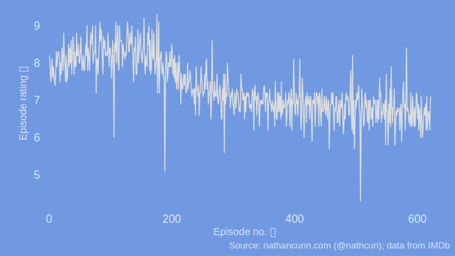
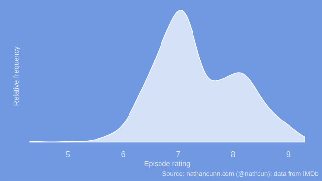
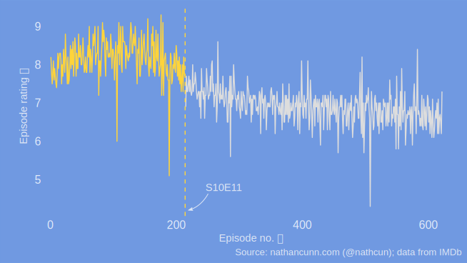
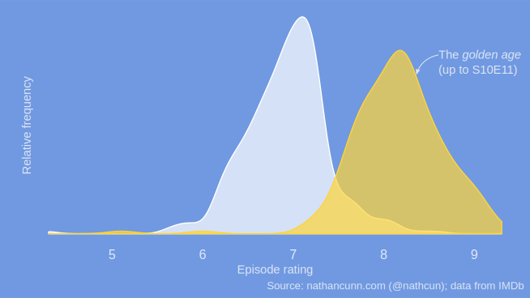

It'd be difficult to argue against the fact that The Simpsons isn't quite the show it once was. Even just a quick glance at the IMDb ratings is enough to see that the show is routinely not hitting the highs it did so regularly in the earlier seasons.

<center>

</center>

I'd suggest that the scale of the decline is likely even worse than it appears here due to [survivorship bias](https://en.wikipedia.org/wiki/Survivorship_bias)---presumably most of the people rating episodes in season 20 are those who enjoyed seasons 1-19---although I'm not sure how one might easily go about correcting for that.

The decline was much like [Fox's transition to a hardcore sex channel](https://youtu.be/vu_qwJiAhGY?t=90): so gradual that you didn't notice it happening, making it difficult to pinpoint exactly when the heyday of The Simpsons came to an end. The general consensus seems to be somewhere around season nine or ten, with some pinpointing *The Principal and the Pauper* (S09E02---the Armin Tamzarian episode) as the watershed moment, with even Harry Shearer (the voice of Tamzarian/Skinner) slamming it as disrespectful to the fans and Matt Groening listing the episode as a mistake and one of his least favourite episodes. Personally I disagree with this being the end of The Simpsons as we knew it, not only because that season had some great episodes, such as *The Cartridge Family*, but also the episode gave us one of my [favourite Simpsons scenes](https://www.youtube.com/watch?v=YDqYVNQIHRg).

But if not then, then when did the golden age of The Simpsons come to an end? If we go back to look at the ratings of the show we can see they clearly arise from a bimodal distribution; that is, there is a group of episodes rated in and around 7/10 and an another group with ratings around 8/10.

<center>

</center>

We know that many of the episodes in this higher rated group were part of the earlier seasons, although some of the later episodes will be in there too. In order to separate these out we could consider performing cluster analysis on the data, essentially finding a way of grouping the episodes so that those with similar ratings are placed in groups together. A standard clustering approach would just group good episodes and bad episodes. However, I want to alter this slightly in that I only want a group to be made up of a single contiguous group of episodes; basically, if the episodes of season 4 are in the same group as the episodes of season 6, then the episodes of season 5 must also be in that group. This means we can define the golden age of The Simpsons as a single stretch of persistently high quality episodes. Other than being a sensible thing to do, this also simplifies the analysis greatly, as while there are many ways to allocate episodes to two groups, uncovering two contiguous groups simply amounts to finding the episode where the first group ends. Ideally we would like to find the episode for which there is the greatest difference between the ratings of all previous episodes and all subsequent episodes.

In order to see this a bit clearer consider the effect of setting this threshold below:
<p style="width: 100%; height: 0px; padding-bottom: 75%; position: relative;">
	<iframe style="width: 100%; height: 100%; position: absolute; left: 0px; top: 0px;" src="https://nathcunn.shinyapps.io/simpsons_decline/" frameborder="0" allowfullscreen="">
	</iframe>
</p>

The effect of choosing the wrong episode is clear in that we'll end up with groups which are not clearly separated. If we set it too early too many good episodes get put into the *bad* category, making it better and, likewise if we set it too late then we make the golden age seem worse.

In order to choose the correct episode, we assume episode ratings in each group arise from distinct *Gaussian* distributions---roughly meaning you would expect ratings to be pretty close to some mean value, the further away from this mean you go the less likely that rating is to occur regardless whether you go above or below the mean. Grouping the episodes then becomes:

-   Pick an episode as the threshold between the golden age and the later seasons
-   Calculate the mean and standard deviation of the ratings for all episodes up to the current threshold episode. Do the same for all subsequent episodes
-   Using these values calculate the likelihood of all the episode ratings---the probability of observing the data you have observed assuming that the data arise from a Gaussian distribution with the means and standard deviations calculated above.
-   Repeat the above steps for a different threshold until you find the grouping which gives the greatest likelihood value.

I coded this up in R (below) and checked for every possible combination (the code runs basically instantaneously so it wasn't worth trying to be smart with this). The episode that the data best supported being the end of the golden age is episode 214, or season 10 episode 11, *Wild Barts can't be Broken*, meaning *The Principal and the Pauper* (S09E02) didn't mark the end of The Simpsons best days.

<center>

</center>

<center>

</center>

With a rating of 7.7 *Wild Barts can't be Broken* is the episode where a curfew is imposed on the children of Springfield after Homer goes on a drunken spree. The next episode, *Sunday, Cruddy Sunday*, in which Homer goes to the Superbowl has a rating of 6.9, quite a bit below the average rating of earlier episodes, meaning counting it as a golden age episode would only serve to make the golden age worse minimising the differences between the two groups.

It's remarkable that the show managed to go for over nine seasons, and over 200 episodes, with an average rating of 8.2. The latter seasons, in contrast, have an average rating of 6.9, with only three episodes in the latter 400+ episodes achieving a rating higher than the average golden age episode---those episodes being *Trilogy of Error*, *Holidays of Futured Passed*, and *Barthood*. Given that the ratings approximately follow a Gaussian distribution, we expect (and, indeed, observe) that roughly half of the golden age episodes exceeded this mean value.

Although The Simpsons isn't quite the show it once was, the decline in the show's latter seasons is more testament to the impossibly high standards set by the earlier seasons than it is an indictment of what the show became.

If you like reading statistical analyses of The Simpsons, you might be interested in my other posts: [What is the best/most quotable Simpsons episode?](http://www.nathancunn.com/2018-01-21-best-simpsons/) and [Who is the main side character in The Simpsons?](http://www.nathancunn.com/2017-07-16-simpsons-characters/)

If you happen to be interested in how I did this analysis, either to try it yourself or to pick holes in it, the code is below. All analysis was done in R, with the plots done using `ggplot2` and `shiny` for interactivity.

``` r
library(rvest)
simpsons_data <- read_html("https://www.imdb.com/title/tt0096697/epdate")

simpsons_rating <- simpsons_data %>%
  html_table() %>%
  .[[1]]

n_obs <- nrow(simpsons_rating)
out <- matrix(0, nrow = n_obs - 3, ncol = 2)

for(i in 2:(n_obs - 2)) {
  n_obs <- nrow(simpsons_rating)
  mu <- c(mean(simpsons_rating$UserRating[1:i]), mean(simpsons_rating$UserRating[(i+1):n_obs]))
  sigma <- c(sd(simpsons_rating$UserRating[1:i]), sd(simpsons_rating$UserRating[(i+1):n_obs]))
  clust <- c(rep(1, i), rep(2, n_obs - i))
  likelihood <- sum(dnorm(simpsons_rating$UserRating, mu[clust], sigma[clust], log = TRUE))
  out[i - 1, ] <- c(likelihood, i)
}
breakpoint <- out[which(out == max(out[, 1])), 2]
```
