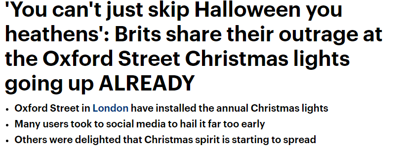
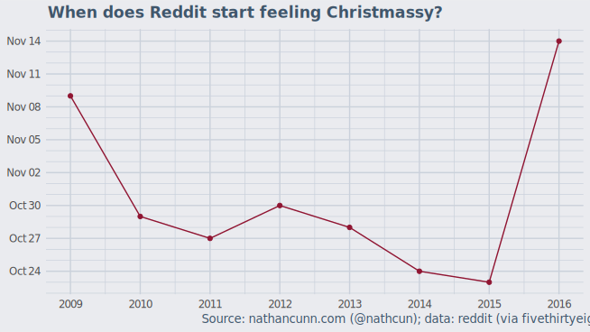
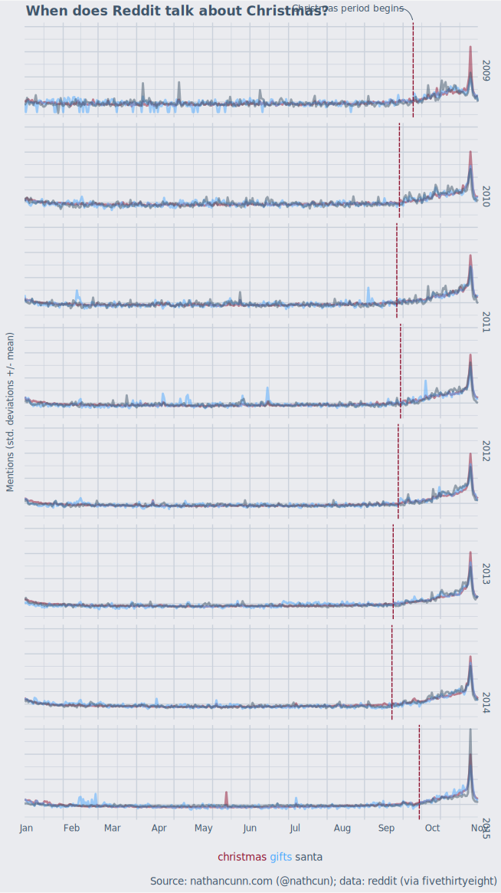
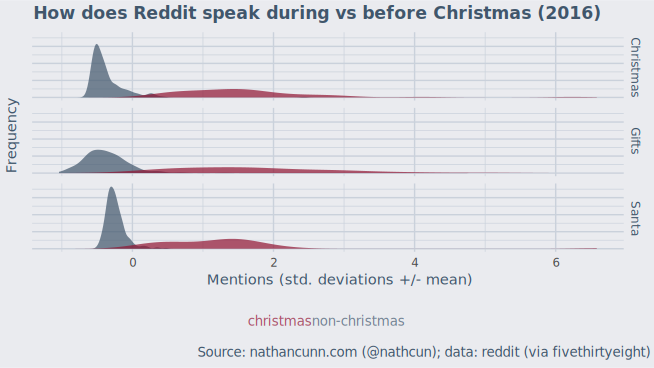

I promised myself I wouldn't do this again. I promised it after [writing this article 3 years ago](https://www.significancemagazine.com/culture/79-does-christmas-really-come-earlier-every-year) and I promised it again when I [wrote a ~~corrected~~ less incorrect version last year](https://www.significancemagazine.com/culture/63-is-christmas-really-coming-earlier-maybe-but-not-as-early-as-august). But, then I discovered fivethirtyeight's [How the Internet Talks](https://projects.fivethirtyeight.com/reddit-ngram/?keyword=lebron.rodgers.trout&start=20071015&end=20170731&smoothing=10) project and couldn't resist trying to answer this question with some new data.

The notion of Christmas coming earlier every year has been a regular feature in my life, with it not truly feeling like the Christmas period until someone has rolled their eyes and said "it gets earlier year" or given an exasperated "already!?" at the sight of the Christmas lights going up around town. Some people take it worse than others, however:  

[Source](http://www.dailymail.co.uk/femail/article-3831977/You-t-just-skip-Halloween-heathens-Brits-share-outrage-Oxford-Street-Christmas-lights-going-ALREADY.html)

But, how to go about finding if the Christmas season truly is creeping into the earlier parts of the year? A good starting point would be to identify, for a given year, when the Christmas period kicked off and then comparing this across years. It's reasonable to assume that during the Christmas period people's internet activity may be a little different to the rest of the year; specifically they may mention Christmas-related terms more frequently. As such, we might identify the beginning of the Christmas period as that watershed moment that maximises the difference in Christmas-related talk between the time before and the time after. If you happen to have read my recent post on [when the golden age of The Simpsons ended](www.nathancunn.com/2017-10-26-simpsons-decline/) you might spot that this is the exact same problem, that of identifying two distinct clusters formed of data from contiguous time periods.

My previous attempts at doing this analysis were blighted by the limitations of accessing data from [Google Trends](https://trends.google.com/trends/). This is a free service provided by Google which allows you to download data on search activity for specific terms over time and, to be clear, is a fantastic service. It's just that getting the data can be a little awkward, owing to: the normalisation of the data; uncertain granularity of the data downloaded; and nebulous download limits. I could rant a lot longer, but the important thing is that, although the fivethirtyeight data set is considerably more restricted, it isn't nearly as painful to get data from.

The fivethirtyeight data is a version of the (Google Ngram viewer)[https://books.google.com/ngrams] which is restricted to the Reddit corpus. Enter a term and it'll give you the frequency of comments submitted to Reddit containing that term, daily since late 2007. Obviously during the Christmas period, you'd expect a greater proportion of Christmassy terms being used in comments. And, indeed, [that does appear to be the case](https://projects.fivethirtyeight.com/reddit-ngram/?keyword=christmas). I chose just a small handful of Christmas terms to get a clearer picture of the trends: 'Christmas', 'Santa', and 'gifts'. I tried with a larger selection of terms but they tended to be almost entirely zero-valued, so I discarded them.

With the data downloaded, I then pre-processed and clustered the data as follows:
    - I first performed a square-root transformation on the data. The data should be somewhat Poisson-distributed given that they represent counts of word appearance, however clustering with Poisson data isn't exactly ideal as the mean and variance are defined to be equal. What this means is that a cluster with a large mean is also, necessarily, a more diffuse cluster. Taking a square-root is the variance stabilising transformation of the Poisson data, meaning it breaks this tie between the mean and variance. It also means we can no longer model the data as Poisson as that only allows for integer values (whole numbers, which most square roots aren't). Modelling as Gaussian doesn't seem like a terrible idea, however. Gaussian data are simply data where most values tend to be pretty close to the mean and you're equally likely to be x% above the mean as you are to be x% below the mean.
    - I then standardised the data, subtracting the mean and dividing by the standard deviation, thus expressing all the data in a common currency. Whether I'm looking at the data for mentions of 'Christmas' or mentions of 'Santa' a value of 1 will mean mentions of the particular term were 1 standard deviation above their respective mean. This is important in cluster analysis to prevent the results being unduly influenced by variables with a greater spread of values.
    - I trimmed the data to only include data from March 1st to December 25th. As I'm looking at years individually I didn't want the non-Christmas period being inflated by the residual Christmas hangover from the previous year, so it made sense to cut off some data from the start. Similarly, I didn't want to dilute the Christmas period by focusing on any time after Christmas day.
    - The cluster analysis was then performed on a year-by-year basis much the same as described in my [previous post](http://www.nathancunn.com/2017-10-26-simpsons-decline/).

So, has Christmas been coming earlier?

2016 aside, there certainly is an argument to be made for Christmas coming earlier with five of the six previous years getting into the festive spirit earlier than the preceding year. It's hard to know what exactly happened to cause such a drastic change in 2016. Given that Reddit is heavily dominated by the American audience, it's possible that their election was stealing their focus and they didn't switch their minds to Christmas until after the election on November 8th. My assumption that Americans switched to Christmas mode once Thanksgiving was over seems incorrect as only one of the years I looked at had Thanksgiving at an earlier date than 2016 did.

As this is now my third time writing this article, I looked at the date the previous articles came out: Nov 11th, Nov 28th, and now Nov 24th. So, "Is Christmas coming earlier?" hasn't been coming earlier every year.

All this analysis was done in R, with plots done in ggplot2 and tidied up after in Inkscape. The data comes from [Reddit](http://www.reddit.com) via [fivethirtyeight](https://projects.fivethirtyeight.com/reddit-ngram/?keyword=lebron.rodgers.trout&start=20071015&end=20170731&smoothing=10).
