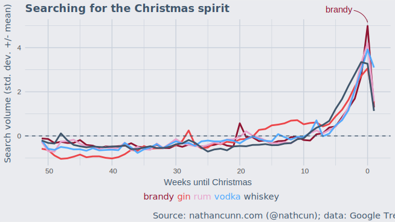

People really love alcohol at Christmas. Or, at the very least they [love searching for alcohol at Christmas.](https://trends.google.co.uk/trends/explore?date=today%205-y&q=%2Fm%2F03dg3,vodka,rum,brandy,%2Fm%2F082bv) In each of the last five years, the search volume for some of the most popular alcoholic spirits has peaked dramatically around the week of Christmas. Is this what people mean when they talk about searching for the Christmas spirit? If so, which is **the** Christmas spirit? Which, more so than any other, do we associate with Christmas above and beyond any other time of the year?

To answer this, I didn't want to simply pick the spirit with the greatest search volume at Christmas, as that will likely only say which one is the most popular in general. Instead, I looked at the standardised search volume---subtracting their respective means and dividing by their respective standard deviations---and chose the spirit whose Christmas search volume was the most standard deviations above their mean value.

The spirits I considered were brandy, gin, rum, vodka, and whiskey. There are other spirits but these are the most common; other popular choices, such as tequila, didn't exhibit the Christmas spike. For each spirit I gathered weekly search volume from Google Trends spanning 2012-2016, standardised them as mentioned above, and averaged across the five years. The weeks don't perfectly align across years, so I matched them according to their distance until Christmas week: one week before Christmas; two weeks before, etc.

So, it appears the Christmas spirit is ... brandy. Hardly surprising, I guess, given its association with Christmas puddings and mince pies, both of which often contain brandy or are served with brandy butter. I'm not particularly a fan of either; Christmas dessert in my house has always been my mum's delicious lemon cheesecake. I also don't drink brandy, so by my own reckoning I'm completely lacking in Christmas spirit. I'll have to get working on that.

All this analysis (I use that term even more loosely than usual) was done in R, with the plot created in ggplot2 and tidied up after in Inkscape. The data come from [Google Trends.](https://trends.google.com/trends/)
