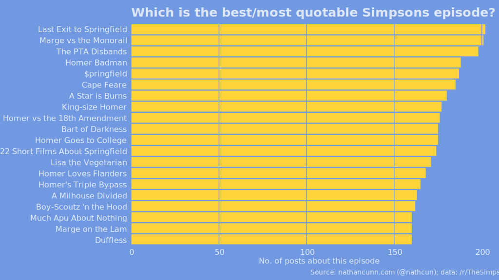
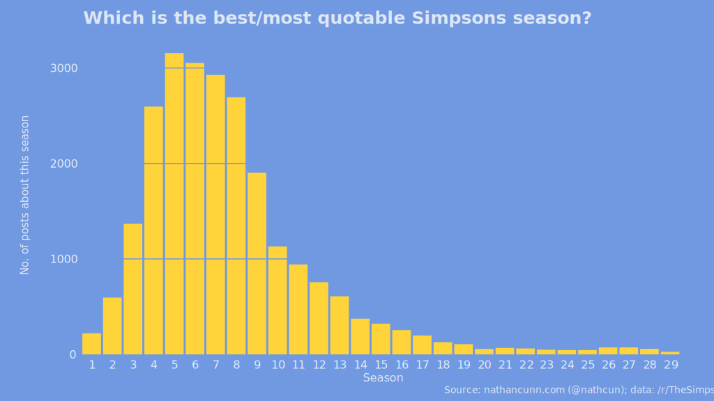

I'm one of those annoying people who makes Simpsons references at any and every opportunity. In fact in recent years I reckon my main interaction with the show has been making obscure references to it rather than actually watching episodes. I'm the worst, I know, but, I also know I'm not the only one who engages with the show in this way. The bizarre phenomenon of [Simpsons shitposting](http://www.reddit.com/r/simpsonsshitposting)---where classic Simpsons scenes are frankensteined together often to [hilarious effect](https://www.reddit.com/r/simpsonsshitposting/comments/7qay4y/steamed_sugar/)---is evidence of how pervasive this form of engaging with the show is.
At over 600 episodes, and no sign of stopping, there's a suitable reference to be made for almost any situation, with some specious claims that the show has even predicted a number of future events such as Donald Trump's presidency, Disney buying Fox, and even 9/11. Of course, the reality is that these things were either references to events contemporary to the episode's airing or, in the case of the 9/11 prediction, just incredibly tenuous associations.

For those who enjoy the show the way I do, the best episode is the one which provides the most material to reference. But, how to find which this is? I'm generally of the opinion that asking someone to tell you their favourite of something is not the best way of finding out the answer---e.g. if you asked me to name my favourite song, you'd find a very different answer than if you consulted my most frequently played on Spotify. It's not just because of my deep shame at how much I love Kiss From a Rose by Seal, people just aren't very good at defining their preferences. So, a good start to answering the question of which Simpsons episode is the best/most quotable is to find out which episodes people actually regularly make reference to.

The Simpsons subreddit, [/r/TheSimpsons](http://www.reddit.com/r/TheSimpsons),
is a community of just under 200,000 members sharing Simpsons news, discussions,
and quotes from their favourite Simpsons episodes. What makes this particularly useful as a source of data is that a large number of the posts are tagged with the episode number they relate to, giving a good source of data for what episodes people commonly refer to. I scraped the last two years worth of posts made in /r/TheSimpsons using the Python tool  [subredditarchive](https://github.com/peoplma/subredditarchive). I know the choice of this timeframe will bias the results against seasons being aired in that period, but I'm sure we can all agree that the best episode of the Simpsons is not in season 20+. In total I scraped just under 42,000 posts. Not all of these are episode references, however, and of those that are, not all have the appropriate episode tag, so a little tidying was needed to be done in R:

``` r
# Convert to lower case
simpsons_df$flair <- tolower(simpsons_df$flair)
# Find flairs that have an episode reference in them
ep_refs <- grep("s[0-9]+e[0-9]+", simpsons_df$flair)
simpsons_df <- simpsons_df[ep_refs, ]
```

  - `tolower()` converts the argument to all lower case letters
  - `grep("find this", in_this)` is a find function that allows for pattern matching. In this case we're looking for strings of the form s**n**e**n** (with **n** indicating a number). To specify this in `grep` you can search for the pattern `s[0-9]+e[0-9]+`, where `[0-9]` represents any number, `+` indicates one or more instances of a number should be found, and `s` and `e` represent themselves.

Afterwards, I was down to 23,903 suitably tagged posts, submitted by just over 1,000 different redditors. Next up I needed to ensure the posts were labelled in a consistent manner as R won't know that S6E2 is the same as S06E02, S6E02, and S06E2.

``` r
# Remove any text which doesn't specify the episode number
flair <- gsub(".*s([0-9]+)e([0-9]+).*", "s\\1e\\2", flair)
# Find cases where the season is specified with a single digit
flair <- gsub("s([0-9]{1})e([0-9]+)", "s0\\1e\\2", flair)
# Find cases where the episode is specified with a single digit
flair <- gsub("s([0-9]+)e([0-9]{1})$", "s\\1e0\\2", flair)
```

  - `gsub("find", "replace with", in_this)` is the find & replace version of `grep`
  - `.` indicates any character except for line breaks. The `*` specifies zero or more occurrences of the preceding pattern.
  - `\\1` will return the first value contained in parentheses in the 'find' argument of the function---`([0-9]+)` the season number.
  - `[0-9]{1}` matches to a single digit number
  - `$` signifies the end of a string

With that done, the data are now in a usable format, and all that's left to be done is tally the occurrences of each episode:


``` r
top_episodes <- simpsons_df %>%
  # Do the following steps for each episode flair
  group_by(flair) %>%
  # Count the number of episodes
  summarise(no_posts = length(flair)) %>%
  # Sort in descending order
  .[order(.$no_posts, decreasing = TRUE), ]
```

And a little `ggplot2` to make it presentable:

<center>

</center>


If you don't know them by their title, the top five episodes are:
### 1. Last Exit to Springfield (S04E17, 202 posts)


in which Homer becomes the power plant's union leader in a bid to win back their dental plan (Lisa needs braces).
### 2. Marge vs the Monorail (S04E12, 201 posts)


in which Springfield falls prey to a conman named Lyle Lanley who sells them a monorail. If you don't know what a monorail is, "mono" means one, and "rail" means rail, and that concludes our intensive three week course.
### 3. The PTA disbands (S06E21, 198 posts)


in which the teachers of Springfield Elementary strike and are replaced by regular Springfielders, resulting in Marge teaching Bart. Purple monkey dishwasher.
### 4. Homer Badman (S06E09, 188 posts)


in which Homer is villified for committing sexual harrassment after grabbing the babysitter's sweet can in an attempt to recover the rarest gummy of them all.
### 5. $pringfield (S05E10, 187 posts)


in which Mr Burns opens a casino in Springfield and Marge becomes addicted to gambling. I. Said. Hop. In.

---

I'm surprised at how close the results are, with just one post separating the top two episodes, and 15 separating the top five. There are also a few surprising omissions: You Only Move Twice (the Hank Scorpio episode); Homer's Enemy (the Frank Grimes episode);
Homer at the Bat (the softball episode); And Maggie Makes Three (the "do it for her" episode); and Burns, Baby Burns (the Larry Burns episode) all of which fall quite far outside the top 20.

Finally, I grouped the episodes into seasons to see which seasons came out on top. The results tend to agree with a general consensus that seasons 3-9 were the show's peak.

<center>

</center>


---

If you enjoyed this post, you might be interested in reading my other Simpsons posts: [When did the golden age of The Simpsons end?](http://www.nathancunn.com/2017-10-26-simpsons-decline/) and [Who is the main side character in The Simpsons?](http://www.nathancunn.com/2017-07-16-simpsons-characters/)
