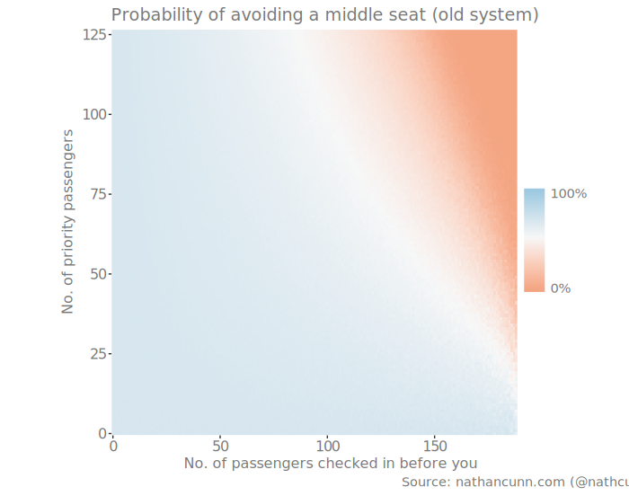
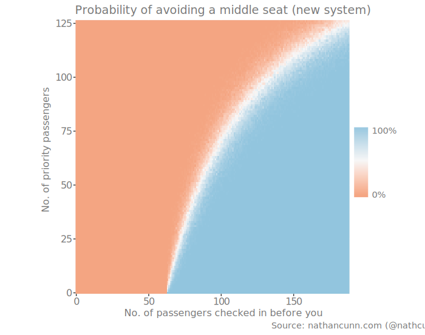

<style>
@import url('https://fonts.googleapis.com/css2?family=Open+Sans&family=Roboto&display=swap');
</style>


I've noticed a lot of indignation lately towards the perceived change in how Ryanair allocates seats. For those unfamiliar with budget airline policies, Ryanair assigns you a seat at random unless you pay a charge---typically between €4 and €10. The ire has been directed at the claim that Ryanair have moved from a system where free seats are assigned completely at random to deliberately assigning you a seat you don't want: giving you a middle seat or splitting up groups. To the best of my knowledge Ryanair denied these claims until presented with the [statistical improbability of their allocations being truly random](http://www.ox.ac.uk/news/2017-06-29-ryanair-random-seat-allocation-not-so-random-says-oxford-university-expert-0). Personally, I found the outrage to be a bit misplaced: even after paying for a preferred seat allocation Ryanair is still regularly the cheapest option available, but, mostly because it actually makes it easier, as a lone traveler, to avoid a middle seat.

To understand why, let's start with the basics: Ryanair planes have 32 rows (they're numbered up to 33 but there's no row 13) with six seats in each (two sets of three) apart from row one, which only has three seats. In total that gives us 189 seats, with 63 of these being middle seats. Therefore, if all passengers are randomly allocated seats you have a one-in-three chance of being assigned a middle seat. Given that you've decided to refuse to pay Ryanair's charges to pick your own seat, the only variables which can affect your chances of getting a middle seat are the number of passengers who have checked in before you (and, therefore, taken a seat) and how many of those are priority passengers (who had their choice of seat).

Let's see how this plays out in the old system. First, let me just lay out a couple of assumptions:
  - You are a lone traveler. Unfortunately, if you're traveling in a group, the old system is almost certainly better for you so I won't even consider that here.
  - All other passengers are lone travelers. This is mostly to avoid making assumptions about the sizes of groups travelling. as I'll explain later, this won't change the outcome of which setup is better.
  - All priority passengers take non-middle seats; given the furore over being assigned middle seats I don't expect any person to pay for the privilege.
  - There is no relationship between priority status and check-in time i.e. if 10% of the passengers are priority passengers, then if I consider a random group of the first passengers to check in I would expect 10% of them to be priority passengers on average. Note that if priority passengers are more likely to check in earlier, then this is equivalent to considering a case where you assume a larger proportion of passengers have priority boarding as it's only those who have checked in before you matter in this analysis.

And, for clarity the two systems we are comparing are: 1) the old system - priority passengers have their choice of seat, others are given a seat at random, with no bias towards middle seats; and 2) the new system - priority passengers have their choice of seat, others are preferentially assigned middle seats to keep window and aisle seats free for paying passengers.

With all this in mind let's consider a very simple simulation of the situation under the old set up. You come to check in, 100 passengers have checked in before you, and 20% of the passengers boarding the plane are priority passengers. All analysis is done using R.

``` r
# Sample 100 passengers: 1 = non-priority (prob = 0.8), 2 = priority
passengers <- sample(1:2, 100, replace = TRUE, prob = c(0.8, 0.2))

# The features of the plane to begin with
n_mid   <- 63
non_mid <- 126
p_mid   <- 1 / 3

# Go through passengers assigning them seats
for(p in passengers) {
  # Check if there are both middle and non-middle seats available
  if(n_mid !=0 & non_mid !=0) {
    if(p == 2) {
      # Priority passengers don't get a middle seat
      mid <- 0
    } else {
      # Randomly assign non-priority passengers a seat
      mid <-  sample(0:1, 1, prob = c(1 - p_mid, p_mid))
    }
  } else {
    # If only one seat type is available passenger is assigned that
    mid <- non_mid == 0
  }
  # Update seats available and probability of being assigned a middle
  n_mid   <- n_mid - mid
  non_mid <- non_mid - (1 - mid)
  p_mid    <- n_mid / (n_mid + non_mid)
}
```

With all previous passengers assigned seats I am now assigned one with probability `p_mid` which in this case turned out to be around 0.4. This can fluctuate depending on the number of priority passengers and how non-priority passengers were assigned seats. Your probability of being assigned a middle seat has actually increased from 0.33 to 0.4 as passengers so far have been more likely to be assigned a middle seat than a non-middle seat. If we extend this for any number of passengers having checked in before you, and any number of priority passengers (I only consider up to 126 priority passengers as the non-middle seats are necessarily gone at that point), we see the following trend:


<center>

</center>

It appears that you should avoid checking in too late as you run the risk of all non-middle seats already having been assigned, particularly if a large proportion of passengers pay to choose their seat. Outside of this, though, there's little you can do to improve your chances of avoiding a middle seat.

The new system can be simulated exactly as before except for this line:

``` r
# Randomly assign non-priority passengers a seat
mid <-  sample(0:1, 1, prob = c(1 - p_mid, p_mid))
```
which simply becomes:

``` r
mid <- 1
```

meaning if there is a middle seat available, non-priority passengers will be assigned it. As such, your probability of getting a middle seat will be one or zero, depending on there being middle seats still available. We can see below how your odds look under the new system:

<center>

</center>

Clearly this is a much more easily game-able system: if you can wait out other passengers you are almost guaranteed to avoid a middle seat unless an enormous proportion of passengers pay to choose their seat. From experience, I wouldn't expect more than 30 priority passengers, meaning if approximately 75 people have checked in before you, you can be relatively sure of avoiding a middle seat as there aren't any left to take.

As I mentioned before, I've only considered lone travelers here, because I didn't want to make assumptions about flight party sizes. For the sake of this analysis, the only other party size that matters is two, as a party of three is equivalent to a party of two, plus a lone traveler, four is two parties of two, etc. In the new system, parties of two are less likely to sit beside each other as they need to pay for that, and so are more likely to take up two middle seats instead of one, improving your chances of avoiding a middle seat even further, meaning it is still the preferable system.

In all, if you want to avoid a middle seat you ought to check in as late as you can in the hope that all the middle seats have already been allocated.


**Disclaimer** despite having written an entire article about Ryanair without once disparaging them, I have absolutely no affiliation to them. I just fly Ryanair regularly and, as such, have an interest in being able to get the best seats. In fact, as I wrote this article mostly during an overnight delay with FlyBe, they, in a strange way, supported this analysis.
