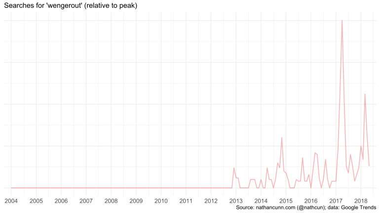
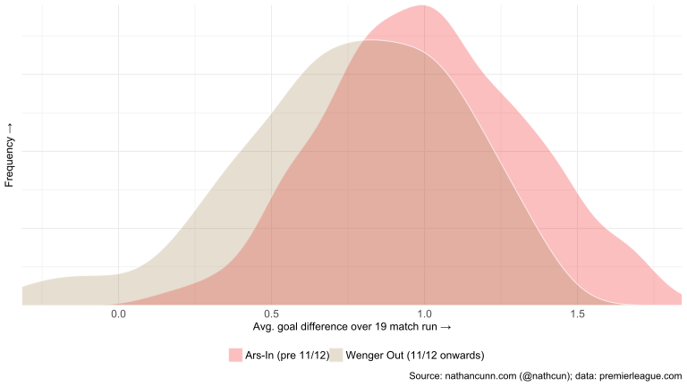
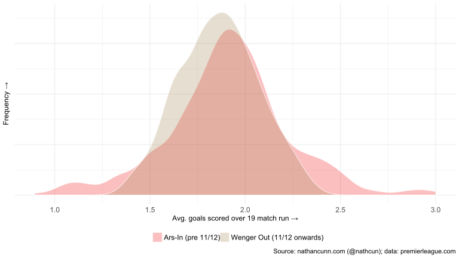
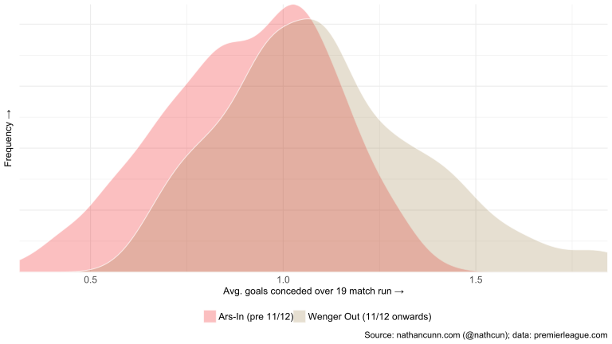
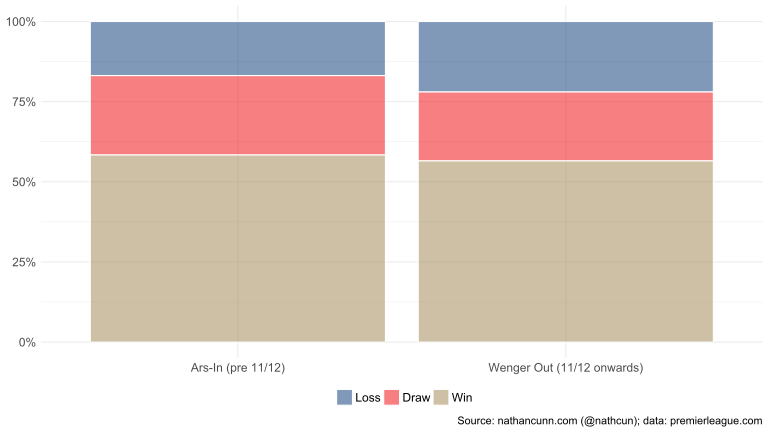

Has there ever been a better case of nominative determinism than a man named Arsene becoming manager of Arsenal, setting the league alight, before ultimately leaving the club like a burning building? The literal seconds of thinking I devoted to that assure me the answer is no.

After 22 years in charge, the whistle has finally been blown on Arsene Wenger's stint at Arsenal. Although this came as poignant news for many fans of Arsenal, and the Premier League more broadly, it came to the delight and relief of many Arsenal fans, some of whom likely never knowing an Arsenal without Wenger at the helm. Wenger's time with Arsenal began in the 1996/97 season, becoming only the third foreign manager appointed in the Premier League, following Ruud Guulit at Chelsea and Ossie Ardiles at Tottenham. While I'm one of those too young to remember football pre-Wenger, it's widely agreed that he had a transformative effect on the league in general, and Arsenal in particular. In his first full season in charge (1997/98) Wenger took Arsenal to a league and cup double. As a foreign manager Wenger was a champion of foreign players, overlooking the English scepticism of foreign ability to handle the rough-and-tumble of the premier league. Although he went on to win two more leagues, and six more FA cups, Wenger's crowning achievement, no doubt, came in the 2003/04 season when Arsenal won the league having not lost a game, the only post-war top-flight team to pull this off. However, despite these great achievements, football fans are a fickle bunch and unmatched achievements only buy loyalty for so long. Much of Wenger's legacy now has been tarnished by the latter stages of his time at Arsenal, with "Wenger out" achieving [meme status towards the end](https://www.telegraph.co.uk/football/2017/02/21/wenger-banner-spotted-anti-trump-protest-march-central-london/).

But, when did it all go wrong for Arsene? Can we cast a cold eye over his time at Arsenal, and pinpoint when the honeymoon period ended? Google Trends data suggest the first notable appearance of the term "wengerout" coming in late 2012. This, coincides with the popularity of "#wengerout" so this may just reflect a rising popularity of Twitter. "Wenger out" dates at least as far back as early 2005, although I can't be sure this strictly relates to a fan desire for Wenger to leave. Given that 2005 is just half a season after the invincibles, I refuse to believe that fans already wanted him gone.

The problem with trying to analyse the data of a manager whose reign lasted as long as Wenger's is that his inauguration predates much of the rich data we have available today. Even Google Trends data only go as far back as 2004, with Wenger being appointed before the founding of Google itself. As for football data, my understanding is that Opta's data for shots, possession, pass completion, etc. only extend as far back as the early 2000s. The official [premier league site](https://www.premierleague.com/results), however, provides historical scorelines for the entire duration of what we now know as the premier league. I agree that the score is a relatively crude assessment of a match, but perhaps it will tell enough of what matters. I can't imagine the Wenger out crew began their chanting on the basis of a holistic analysis of Arsenal's match statistics; they based it on results. If Arsenal had won every game this season with 10% possession, and 5% pass completion I think only the purest of football purists would be begging for him to leave.

Although data for other cups are available, I'm only going to analyse premier league data. This is a fairly informal analysis and branching into other competitions opens the analysis up to too many unknowns: how do you weight a league cup match vs, say, Doncaster with a Champions League tie with Bayern Munich; how should a final be weighted relative to a group stage match; do we consider two-legged ties as a single match; what about some of the dead rubbers towards the end of the Champions League group stages? With the Premier League, at least theoretically, every game operates under the same conditions and no game is more important than any other. In saying that though, there is a discrepancy in the difficulty of opponents faced. To sidestep this I've taken a moving average of Arsenal's goal difference (goals scored minus goals conceded) over a 19 match run. For those unaware 20 teams compete in the Premier League, meaning (other than across season boundaries) a 19-match average should give a balanced view of Arsenal's current form against the rest of the league.

In order to find when things went downhill, I performed a constrained cluster analysis. I'm not going to get into the specifics here; if you happen to have read this blog before you'll know I use this technique _a lot_ (exhibits [A](http://www.nathancunn.com/2017-10-26-simpsons-decline/), [B](http://www.nathancunn.com/2017-11-24-christmas-reddit/), [C](https://www.statslife.org.uk/culture/3108-is-christmas-really-coming-earlier-maybe-but-not-as-early-as-august), and [D](https://www.statslife.org.uk/culture/1892-does-christmas-really-come-earlier-every-year)). If you're interested in the details of the analysis, or want to see similar analyses on The Simpsons or Christmas, you might want to have a look at those posts. Simply put, the aim is to break the data up into two distinct groups that could be described as 'the before' and 'the after.' As I mentioned before I performed the analysis solely on the 19-match moving average of goal difference, treating the data as having arised from two distinct Gaussian distributions. This does mean making a couple of assumptions which you may or may not agree with, namely: a two goal victory is twice as good as a one goal victory; winning 5-4 is equivalent to winning 1-0; and a five-goal loss is equally as negative as a five-goal victory is positive. With that in mind, the watershed moment appears to be May 8th 2011, three games from the end of the 2010/11 season. I don't want to lend too much authority to this exact date, so from here I'm going to call Wenger's best days ("ArseIn") the period from his appointment to the end of the 2010/11 season, and the "Wenger Out" period from 2011/12 until the end.

What happened in the latter stages of the 2010/11 season that changed Arsenal's fortunes so? Arsenal finished the season in 4th, one place down on their previous season's finish. They make it to the final of the league cup, but disappointingly lose to Birmingham thanks to a last-minute goal. They make it to the round of 16 in the Champions League, the best they'll do for the remainder of Arsene's time, having finished at least in the quarter finals in each of the three previous seasons. Interestingly also Stan Kroenke, the object of ire for many Arsenal fans, becomes majority shareholder in the club in April 2011. Over the Summer that follows Arsenal's fortunes aren't much better, losing club captain Cesc Fabregas to Barcelona and key players Samir Nasri and Gaël Clichy to Manchester City.

Looking at average goal difference over a 19-match window, it's clear that in Wenger's earlier days Arsenal tended to run a slightly higher average goal difference than in later seasons. With an average of 0.97 goal difference decreasing to 0.80 from 2011/12 onwards. Incredibly, on more than one occasion in the Wenger out era, Arsenal went on a 19-match streak averaging a negative goal difference. The first of these occurring in early 2011/12, a run which included _that_ 8-2 loss at Manchester United, a 2-0 loss at Liverpool, and a 4-3 loss at Blackburn. The other streak came at the tail end of the 2013/14 season, including a 3-0 loss at Everton, a 6-0 defeat at Chelsea, 5-1 at Liverpool, and 6-3 at Manchester City.

Goals scored across the two periods have largely the same mean (1.23 vs 1.21) although early Arsenal showed more of a knack for excitement, going on long streaks scoring many goals, although conversely also going on relatively low-scoring runs also. Their best run came early in the 2009/10 season with a 6-2 win at Blackburn Rovers, a 4-0 win at Wigan Athletic, a 6-1 win at Everton, and _that_ 4-4 draw with Liverpool.

Goals conceded shows quite a stark difference between the two periods with extreme tails in different directions. The early years show a tendency to go on runs of games with very few goals conceded, their best period coming in 1999 when they went on a 19-match streak conceding 0.32 goals per game. Their worst spell falls under the early 2011/12 season patch mentioned under goal difference. Their goals conceded jumped from 0.73 per game per 2011/12 to 0.79 per game from 2011/12 onwards.

Surprisingly Arsenal's win rate didn't drop noticeably, going from 58% to 57%. However, where previously they may have drawn, they now were losing many more games, losing 22% as opposed to 17% previously.

The difference is more striking however when you consider their performance against the rest of the classic big 4 (Manchester United, Liverpool, and Chelsea. I ruled out the big 6 as Tottenham Hotspur were a very different proposition when Wenger took over, and, well, Manchester City weren't even in the Premier League then). In the early years Wenger took an average 1.42 points in games against his top 4 rivals, dropping to just 0.86 in Wenger out era. By comparison their performance against the rest of the league stayed at a steady 2.1 points per match. Given that the competition increased in the latter years with the emergence of Manchester City, the strengthening of Tottenham Hotspur and some strong outsiders, e.g. Leicester City, it suggests Arsenal perhaps got better against the very bottom sides during this period. Arsenal's away form disimproved notably also during this period, losing just short of one-third of away games in the league from 2011/12 onwards, up from 24.6% in the early years. Over the same period, their win % away from home didn't noticeably change.

|         | Home win %          | Away %  |
| :------------- |-------------:| -----:|
| Ars-In (pre 2011/12)      | 71 | 46 |
| Wenger Out (2011/12 onwards)      |  68     |   46 |

In all, these data suggest Wenger's downfall wasn't as pronounced as you might expect given the opinion of some of the fans. However, at the very top, the margin separating the very best is thin and perhaps prolonged failure to add to the collection of the major trophies is really all that matters.

All the analyses mentioned above were performed using R, with visualisation done in ggplot2. Data were sourced from the official Premier League website, and Google Trends.
