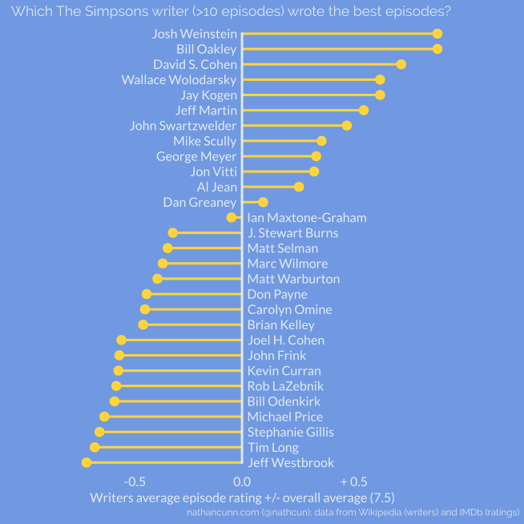
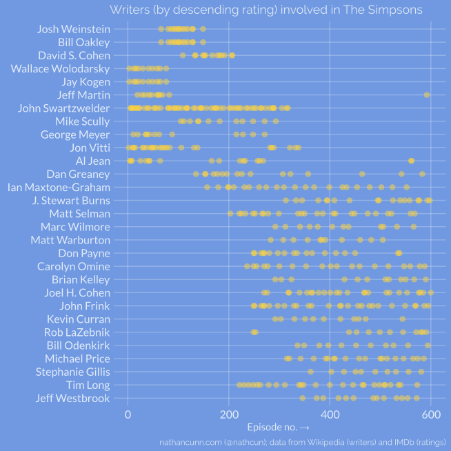

Around this time last year, I wrote a post dissecting the [decline of The Simpsons ](http://www.nathancunn.com/2017-10-26-simpsons-decline/) from its peak in the mid
90s. Having found that the golden age of the show spanned an incredible 214 episodes---
as a comparison Friends, which seemed to have been on TV _forever_,
managed 236 episodes in total---I was happy to accept that such a decline was inevitable,
if not long overdue. However, many others offered up explanations for the fall: the start, and
success, of Family Guy forcing the show to branch away from its roots into a zanier show;
some watershed episodes such as The Principal and the Pauper, or 22 Short Films about Springfield
fundamentally changing the formula of the show; or the glut of celebrity cameos shoehorned
into the show---compare Lady Gaga's cameo with, say, Dustin Hoffman as Mr Bergstrom.
One reason that came up frequently was that the downfall coincided with a shift in the
writers of the show.

To examine this, I grabbed a list of all The Simpsons episodes, their writers, and their
respective IMDb ratings. I'm not going to pretend that IMDb is an oracle when it comes
to ratings---Big Bang Theory has a rating of 8.2/10 for starters. Also, [later Simpsons
episodes have much fewer ratings](https://twitter.com/nathcun/status/924658887793500160)
than earlier episodes, and it's likely those ratings are skewed in some way---if I really
hated seasons 15-20, I'm unlikely to watch, and therefore give rate, seasons 20+.
So, IMDb ratings are far from perfect, but they're the best I have available to me
without resorting to my own subjective ratings.

Much to my surprise, The Simpsons has had over a hundred writers throughout its life.
Growing up watching it, I assumed the show was the product of a single small team of
writers. While a few are regular contributors, many writers have only written once or twice.
For this analysis I only considered those writers credited with ten or more episodes.
Although most episodes have a single writer credited, many episodes have more than one---Treehouse of Horror
 episodes in particular---where this occurred each individual writer still received the
 full episodes rating towards their own average. While I'm not familiar with the writing
 process of The Simpsons, I'm sure that even where a single writer is credited, the
 writing was the product of more than one person. For example, Conan O' Brien
 is often noted as playing an important role in The Simpsons throughout the
early 90s, yet he only has 4 writing credits.

<center>

</center>

Topping the list of writers is the pair of Bill Oakley and Josh Weinstein, who co-wrote
all their episodes and were showrunners throughout seasons seven and eight. Between them
they wrote classic episodes such as _Lisa vs Malibu Stacey_, and _Bart vs Australia_.
And, although I mentioned _22 Short Films about Springfield_ as being seen as something
of a harbinger of the decline, Bill Oakley is credited with the [enormously popular
steamed hams scene.](https://www.youtube.com/watch?v=mDUIGvpDolw)

Although the presentation of the results above might suggest some failing on the
part of writers towards the bottom of the list, bear in mind these writers all
wrote 10+ episodes of The Simpsons.

But, how does this translate into a decline in the quality of the show over time?
One way to look at this might be to get an estimate of what rating we might expect an episode
to have considering just the average rating of the writers credited on that episode.


<center>

</center>

This does show what we would expect, if every writer wrote a perfectly average
episode every time they were credited, the show would have begun declining some time
around its 200th episode. The steady line of points around the middle is the 'Other'
rating, of those writers
credited with fewer than ten episodes. Interestingly, the white line, showing a smoothed
average rating of episodes falls below the average rating of 'Other' writers at
episode 213, just one episode earlier than my previous post found the golden age
to have ended.

However, this still doesn't quite get at the question: did a change in writing staff
prompt a change in quality in the show? It's possible writers who contributed to great
early episodes have lower averages simply because they stayed with the show long enough.
Something about living long enough to see yourself become the villain.
To check this, I looked at which episodes writers were involved in:

<center>

</center>

The writers are sorted as before, according to the average rating of the episodes
the respective writers were involved in. It's clear to see that the more highly rated
writers tended to be exclusively involved in the earlier days of the show.


All the results in this post were done in R, with plots done in ggplot2 and
subsequently touched up in Inkscape. If you're interested in how I got the data
together then read on.

The writers data were sourced from Wikipedia, while the ratings were sourced from
IMDb using the R package `rvest`. For the most part this was an exercise in using
regular expressions to get the text data cleaned up.


``` r
library(rvest)
library(tidyverse)

simpsons_wiki_1 <- read_html("https://en.wikipedia.org/wiki/List_of_The_Simpsons_episodes_(seasons_1%E2%80%9320)")
simpsons_wiki_2 <- read_html("https://en.wikipedia.org/wiki/List_of_The_Simpsons_episodes")

simpsons_writers_1 <- simpsons_wiki_1 %>%
  html_nodes(".wikiepisodetable") %>%
  html_table()

simpsons_writers_2 <- simpsons_wiki_2 %>%
  html_nodes(".wikiepisodetable") %>%
  html_table(fill = TRUE)

# Remove the movie and other non-standard episode tables
simpsons_writers_1[[19]] <- NULL
simpsons_writers_2[c(4, 12)] <- NULL

simpsons_writers <- rbind(do.call(rbind, simpsons_writers_1),
                          do.call(rbind, simpsons_writers_2))

ratings <- list()
episodes <- list()

for(i in 1:3) {
  page <- read_html(sprintf("https://www.imdb.com/search/title/?series=tt0096697&count=250&sort=release_date,asc&view=simple&page=%d&ref_=adv_nxt", i))
  ratings[[i]] <- page %>%
    html_nodes(".col-imdb-rating") %>%
    html_text()
  episodes[[i]] <- page %>%
    html_nodes(".col-title") %>%
    html_nodes("a") %>%
    html_text()
}

all_episodes <- unlist(episodes)
all_episodes <- all_episodes[seq(2, length(all_episodes), by = 2)]
all_ratings <- as.numeric(unlist(ratings))

ratings_df <- data.frame(imdb_title = all_episodes[1:600],
                         wiki_title = simpsons_writers$Title[1:600],
                         rating = all_ratings[1:600],
                         writer = simpsons_writers$`Written by`[1:600])
```

Now to cleaning these data up. There's not really a principled way of doing this,
I just scanned the data for obvious issues and then used regex to clean up any errors
I spotted. The aim is to get the data into a format where each row has an individual
writer involved in an episode and the corresponding rating.

``` r
# Some rows don't have spaces between names
# Identifying cases where two lower case letters are followed by an upper case
# And placing a space before the upper case letter
# Looking for two lower case letters to avoid names with 'Mc'
ratings_df$writer <-   gsub("([a-z]{2,})([A-Z])", "\\1, \\2", ratings_df$writer)
# Removing some additional non-name text as well as 'and' and '&'
ratings_df$writer <-   gsub("and|&|Teleplay by.*:|Story by.*:", ", ", ratings_df$writer)
# Removing footnote tags
ratings_df$writer <-   gsub("\\[.*\\]", "", ratings_df$writer)

# Separating the writers
ind_writers <- sapply(ratings_df$writer, function(x) strsplit(x, ","))
# Find how many writers were involved on each episode
no_writers <- as.numeric(sapply(ind_writers, length))
row_index <- rep(1:600, times = no_writers)
# Duplicating episodes which have >1 writer and giving each writer a row
ratings_df <- ratings_df[row_index, ]
ratings_df$ind_writer <- unlist(ind_writers)

# Cleaning the individual writers text
# Removing any leading or trailing whitespace
ratings_df$ind_writer <-   gsub("^[ ](.+)", "\\1", ratings_df$ind_writer)
ratings_df$ind_writer <-   gsub("[ ]$", "\\1", ratings_df$ind_writer)
# A few of the writers went by pseudonyms for some episodes
ratings_df$ind_writer[ratings_df$ind_writer == "Penny Wise"] <- "Jon Vitti"
ratings_df$ind_writer[ratings_df$ind_writer == "Pound Foolish"] <- "David Silverman"
ratings_df$ind_writer[ratings_df$ind_writer == "Lawrence Talbot"] <- "Dana Gould"
```


Finally, I just used dplyr to get the mean episode ratings per writer.

``` r
# Remove cases where I've wrongly identified multiple writers
ratings_df <- ratings_df[ratings_df$ind_writer != "", ]

# Recode writer to "Other" if involved in <10 episodes
ratings_df <- ratings_df %>%
  group_by(ind_writer) %>%
  mutate(inc_writer = ifelse(n() >= 10, ind_writer, "Other"))
# Get the average episode ratings for writers with over ten writing credits
ratings_df <- ratings_df %>%
  group_by(inc_writer) %>%
  mutate(avg_rating = mean(rating))
```
