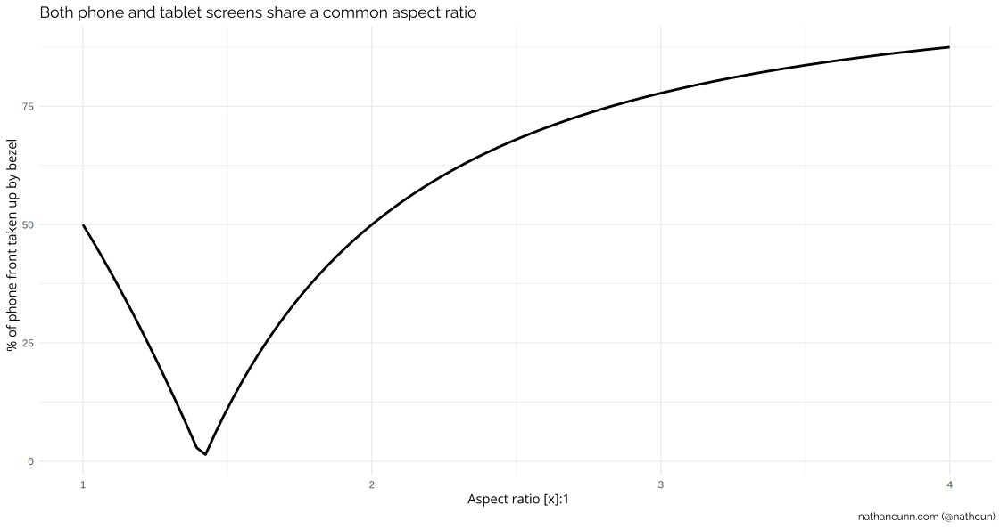
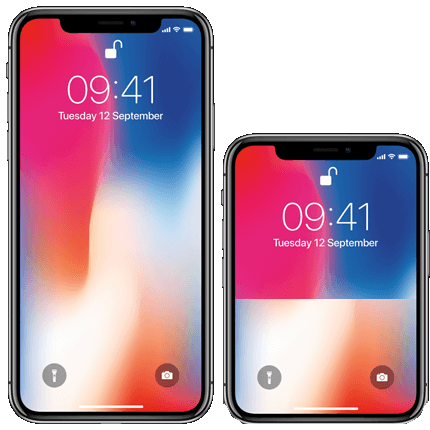

The prospect of a foldable phone/tablet combo has been causing a stir lately, thanks
to [Samsung teasing their latest innovation: a phone that unfolds into a tablet.](https://twitter.com/samsung_dev/status/1060251017890037765) While I don't particularly fancy one of these devices---not that I could afford one---I can appreciate the technological feats that they are.

However, the phones seem to fly in the face of two notable drivers in phone
development recently:
  - Making phones taller. In order to accommodate us consuming media on our
  phones, companies have been making phones to closer match the aspect ratio (the ratio
    of a screen's width to its height) of modern TV and film (commonly 16:9, or 18:9),
    leading to phones like the  Samsung Galaxy S9 having an 18.5:9 aspect ratio and
    the iPhone X featuring a 19.5:9 aspect ratio.
    By comparison the iPhone 4 had a 3:2 aspect ratio, so it would need to add 44% to
    the height of its screen to match the iPhone X.
    (Although I just said the aspect ratio is
    width:height and phones aren't wider than they are tall, their aspect ratios are usually
    specified as height:width.)
  - Making bezels smaller. In order to prevent phones from becoming _too_ unwieldy
  with these larger screens, there's been a push to decrease the size of the phone bezels:
  the area on the front of your phone which is not the screen. This has led to innovations
  such as the Infinity Displays on the latest Samsung phones and the less appreciated
  camera notches showing up in many others from the Essential Ph-1, to the iPhone X,
  and the Google Pixel 3.

So, what's the problem? Why not just have both the tablet and the phone 18:9, with minimal
bezels? Let's start with the phone as 18:9, meaning a height of 18 units, a width of 9 units.
As the phone will be in portrait while the tablet in landscape, the tablet's height will also
be 18 units, thus giving the tablet a width of 36 units in order to maintain the 18:9 ratio.

So, if we must have 18:9 aspect for both screens, then we'll have to give over 50% of
the front of the phone to bezels.

Or, maybe we could sacrifice having some bezels on the tablet screen? If we have no bezel
on the phone screen, then the tablet's maximum width is twice the phone's width (plus a
  little for the folding mechanism). If we're sticking
to our 18:9 guns, the absolute best we can do here is a tablet screen with width 18,
and height 9 i.e. literally the phone's screen but in landscape. Even if we settle
for bezels on the tablet side, or even just black bars when watching movies, we won't be
watching on a screen any bigger than what we already have.

Ok, so let's try instead to build the device from a tablet perspective. I'm going to make
one basic assumption: the tablet screen is primarily for watching TV/film. I'm sure people will
find other uses, but in terms of mass appeal, surely that must be its purpose?

However, as I mentioned, the most common aspect ratios are 16:9 and 18:9, meaning if we want
our tablet screen to maintain that ratio, we'll have to settle for phone screens roughly 8:9,
or 9:9---roughly square shaped. This isn't out of the question, but would be a deviation from
what we expect of our phones. But then, so is folding the damn thing up.

If we go back to wanting our phone and our tablet to share an aspect ratio, can we find a
suitable ratio such that the added bezels are minimised?

Below I've looked at how much of the phone front real estate we'd have to devote to a bezel if
both screens are to share an aspect ratio, assuming the tablet side is always bezel-free, and the
phone width is exactly half the tablet width:

Clearly there are definitely better choices than 2:1 (or 18:9), with a value allowing for a
totally bezel-free foldable phone  at some value between 1 and 2.

Discovering this value is actually quite simple, we just want to
uncover $x = \frac{width}{height}$ such that $x = 2 \times \frac{height}{width}$ or
equivalently $x = 2 \times \frac{1}{x}$. Multiplying both sides by $x$ gives $x^2 = 2$ or
$x = \sqrt{2} \approx 1.4$. So, the ideal aspect ratio would be for the phone to be $1.4$
times its width. Incidentally, this is the same ratio used in standard A format paper.

I did a quick mock-up of how this might impact the iPhone X,
just look at this stubby little thing:

Far be it from me to assume that I know what Samsung's plans are with regards this
technology and I'm certainly not rubbishing the innovation, I just wanted to clarify
the basic maths that says these foldable phones just can't be bezel-free and in the
form factor we expect from modern phones/tablets.
