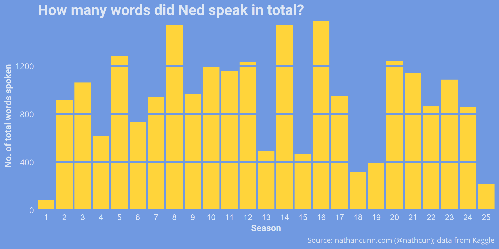
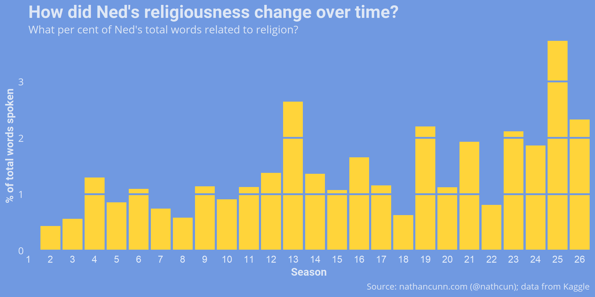
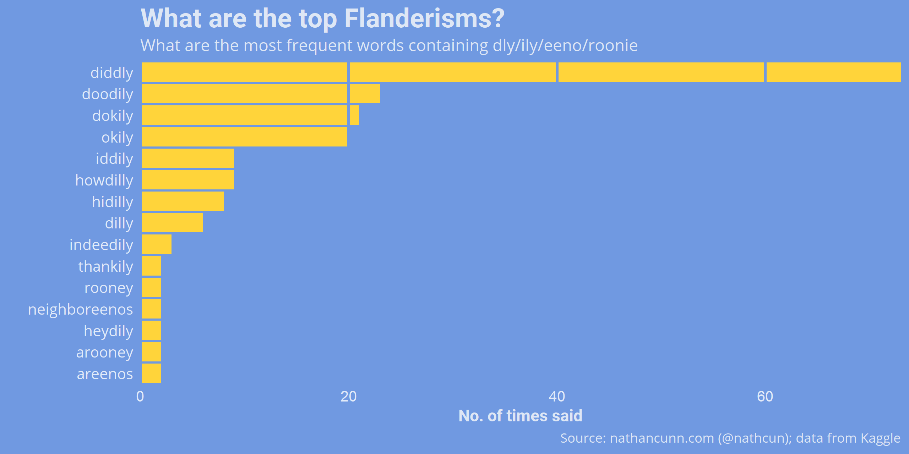
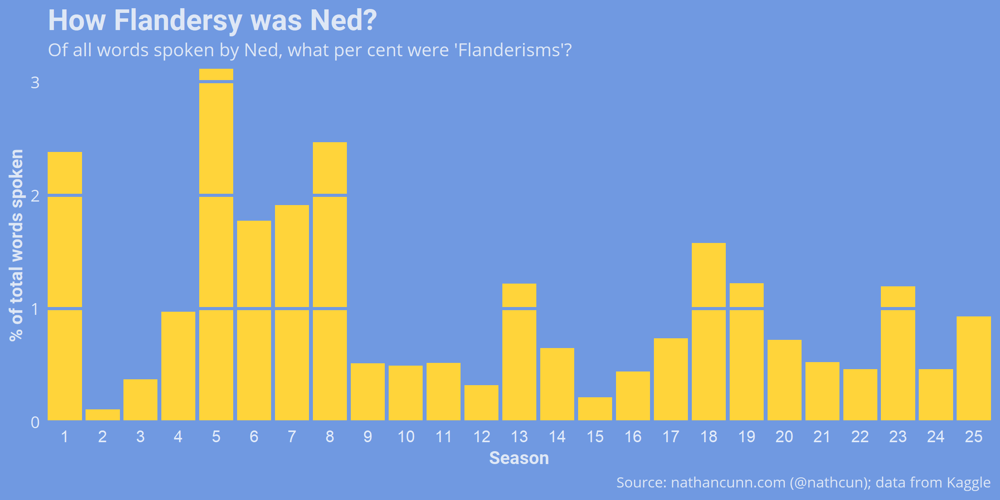
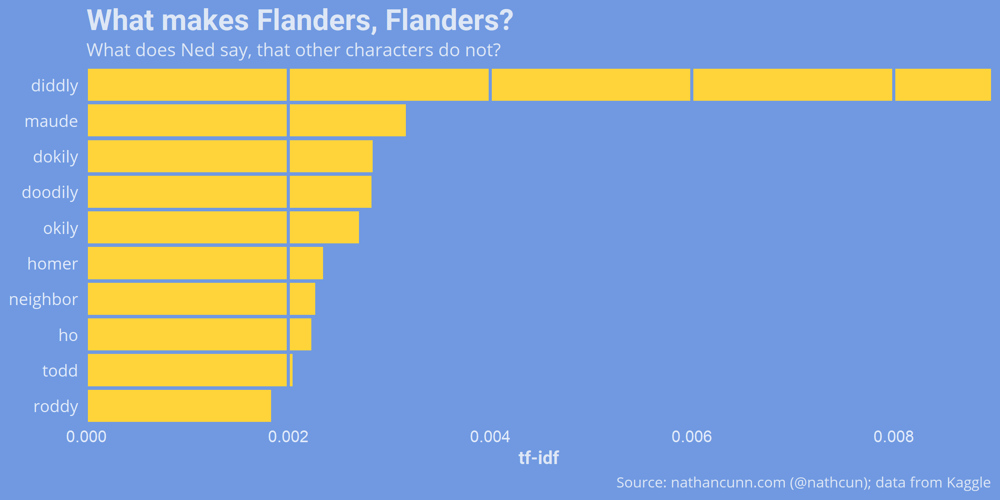
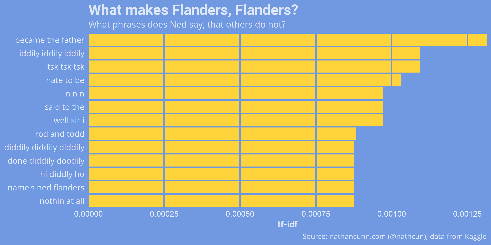
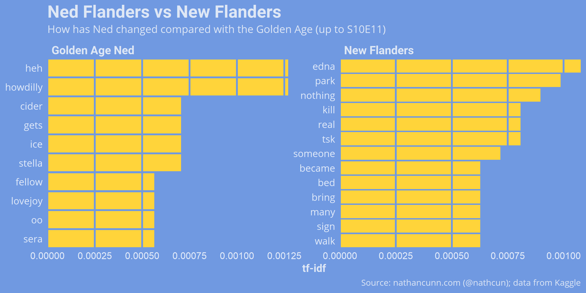

One of the many words The Simpsons has given to us is *Flanderisation*---the gradual erosion of the nuances of a character until they become little more than a parody of themselves. Although, of course, named after Ned Flanders the term has found use in a number of other works; [TV Tropes has a multiple-media-spanning list of examples](https://tvtropes.org/pmwiki/pmwiki.php/Main/Flanderization).

Given the [rotating cast of writers contributing to The Simpsons](http://www.nathancunn.com/2018-10-21-simpsons-writers/), it's easy to see how characters may lose their nuance as writers create imperfect recreations of other writers imperfect recreations. In the case of Ned Flanders, what was introduced as a kindly neighbour serving the role of a virtuous foil for the protagonist Homer, over time became little more than a diddly-doodly-ing religious nut. TV Tropes suggests two separate stages of Flanderisation: 1) the exaggeration of his religiosity for easy jokes between seasons 2-9; and 2) the increasingly extreme and intolerant religiousness espoused from season 9 on.

In order to explore the truth to these claims, I did some digging through The Simpsons scripts. The data are available from [Kaggle](https://www.kaggle.com/ambarish/fun-in-text-mining-with-simpsons/data).

### Preparing the data
Having downloaded the data, I load it into R. The dialogue is formatted as `Character name: (Emotion) Dialogue`, so I need to use some regex to strip this down to just the dialogue.

``` r
library(tidyverse)

ep_scripts <- read_csv("data/simpsons_scripts.csv") %>%
  filter(speaking_line == TRUE) %>%
  mutate(raw_text = gsub(".*:", "", raw_text), # Remove all text before a semicolon
         raw_text = gsub("\\([^()]+\\) ", "", raw_text), # Remove any text within brackets
         raw_text = tolower(raw_text) # Convert all to lower case
  )
```

That done, I now want to get the data into 'tidy-format', that is each row of our resulting tibble should contain a single, spoken word (a token). Much of the text analysis is done via Tidytext following [Julia Silge and David Robinson's great manual](https://www.tidytextmining.com/index.html).

``` r
library(tidytext)

onegrams <- ep_scripts %>%
  unnest_tokens(word, raw_text)

```

### Ned's increased religiousness
The first thing I wanted to examine was the claim that Ned Flanders has become more religious over the seasons. But first, to get a baseline idea of Ned's involvement in the show, I looked at how many words Ned said per episode. As the data are in the tidy format, this amounts to counting the rows of our data where Ned is speaking for each season.

``` r
onegrams %>%
  filter(raw_character_text == "Ned Flanders") %>%
  group_by(season) %>%
  summarise(n = n())
```



But, of these what per cent was religious? Again, I used some regex to find mention of religious terms by Ned. The list I chose is fairly arbitrary, but I hope should give a good picture of the overall trend.

``` r
onegrams %>%
  filter(raw_character_text == "Ned Flanders") %>%
  group_by(season) %>%
  mutate(season_words = n()) %>% # Get the total words spoken per season
  filter(str_detect(word, "god|hell|sunday|heaven|sin|
                        forgive|saint|grace|devil|satan|
                        jesus|holy|spirit|devout|church|
                        mass|pray|praise|christ")) %>%
  summarise(n() / mean(season_words) * 100) %>%
  ungroup()

```
Interestingly none of Ned's words was religious in season 1, although as previously seen he contributed very little dialogue then. The trend doesn't appear very clear. There is, perhaps, a gradual increase of mentions of religion by Ned but, aside from a few seasons, no major increase.



### Increased _Flanderisms_

Being religious isn't Ned's _only_ trait, and part of his Flanderisation also involves his particular manner of speaking...arooney. Again, I used some regex to pull out the top _Flanderisms_, which I defined as any word containing any of 'ly', 'eeno' or 'roon'. This obviously picks up a lot of false positives, e.g. family, so I created a table of false positives, `mystopwords`, and removed them afterwards. I also made some spelling adjustments to make the spellings consistent, e.g. 'hidily' became 'hidilly'.

``` r
onegrams %>%
  filter(raw_character_text == "Ned Flanders",
         str_detect(word, "ly|eeno|roon")) %>%
  anti_join(., mystopwords, by = "word") %>%
  count(word)

```

The top Flanderisms are much what we would expect with 'diddly' far and away the most common, although surprisingly I only picked up on two neighboreenos.



Looking at Ned's use of Flanderisms over time follows closely to TV Tropes claims that Ned underwent an increase in how _Flandersy_ he was between seasons 2-9, followed by a change from season 9 on.



### What makes Flanders, Flanders?
We might also approach this task assuming we know nothing of Ned's manner of speaking and try to discover what he says that differentiates him from the other characters. This involves identifying words which have a high TF-IDF (term-frequency inverse-document-frequency) for Ned. The TF-IDF is the product of two terms:
$$
\textrm{TF-IDF} = TF \times IDF
$$
  - Term frequency (TF):
  $$\frac{\textrm{\# times Ned says word}}{\textrm{\# words Ned says}}$$
  How frequently does Ned say a particular term? Thus, words that Ned commonly says will have a high TF value.
  - Inverse Document Frequency (IDF): $$log\left(\frac{\textrm{\# characters in total}}{\textrm{\# characters who use the term}}\right)$$ The log of the inverse of how many characters use that word. IDF will be low if many characters use this term.

Thus, the TF-IDF is a balancing act between words which are uttered frequently by a character but more rarely in general.

Consider the word 'the'. Ned Flanders says this word $772$ times in my data out of $23199$ words in total, giving this word a TF of $\frac{772}{23199} = 0.03$. However, every other character uses this word, giving an IDF of $log(\frac{69}{69}) = log(1) = 0$. (I selected only characters with at least 100 lines, leaving 69 remaining). The word 'the', therefore, has a TF-IDF of zero. This is great because knowing Ned Flanders uses the word 'the' a lot tells us nothing about Ned when every other character uses it too.

Now, let's instead consider the word 'Maude'. Ned mentions his wife fewer times (TF $= 0.002$) but other characters are much less likely to mention her name (IDF $= 1.84$) giving it a TF-IDF score of $0.003$.

In all, scores with high TF-IDF scores will be those that make Ned, Ned. We can pick out those that most distinctly depict Ned as follows:

``` r
onegrams %>%
  count(raw_character_text, word, sort = TRUE) %>%
  bind_tf_idf(word, raw_character_text, n) %>%
  filter(raw_character_text == "Ned Flanders") %>%
  arrange(desc(tf_idf))
```



The TF-IDF isn't restricted to single-word terms. We can also consider what phrases (or _ngrams_) define characters. Here is a list of the three-word phrases most associated with Ned.



Some interesting ones show up here, and some others highlight a weakness of this approach. The phrase "n n n" isn't a mistake. It comes from Ned singing his version of Welcome To The Jungle (_n-n-n-n-n-n-knees!_). Although this only comes up in one scene, he utters the three-word phrase multiple times and is the only character to do so. Although in saying that, "_nothin at all, nothin at all, **nothin at all**_" comes up in just one episode too, and there's no doubt that's a Ned line.


As a final comparison, instead of comparing Ned vs the other characters, I compared Ned with himself. Specifically, I examined how Golden Age Ned ([S10E11 and earlier](http://www.nathancunn.com/2017-10-26-simpsons-decline/)) differed from his later incarnation ("New Flanders"). Again, I calculated the TF-IDF, except in this case the documents being compared were just words said by Golden Age Ned and New Flanders. Note that in this case if Ned says something during and after the golden age, this term will necessarily have a TF-IDF of zero, regardless of how frequently Ned says the term.


Golden Age Ned feels much more distinctly Ned to me, as I can attach most of the terms to at least one scene: with terms like howdilly, cider, and reference to Reverend Lovejoy (did he _really_ never mention him after the Golden Age?) Apart from his mention of Edna, I'm not sure I can attach a context to any of the other terms.

All the results in this post were done in R, with plots done in ggplot2. Simpsons images are from [Frinkiac](www.frinkiac.com).

If you enjoyed this, you might be interested in my other Simpsons-related posts:

[When did the golden age of The Simpsons end?](http://www.nathancunn.com/2017-10-26-simpsons-decline/))

[What is the best/most quotable Simpsons episode?](http://www.nathancunn.com/2018-01-21-best-simpsons/)

[Who is the main side character in The Simpsons?](http://www.nathancunn.com/2017-07-16-simpsons-characters/)

[Why did the golden age of The Simpsons end?](http://www.nathancunn.com/2018-10-21-simpsons-writers/)
