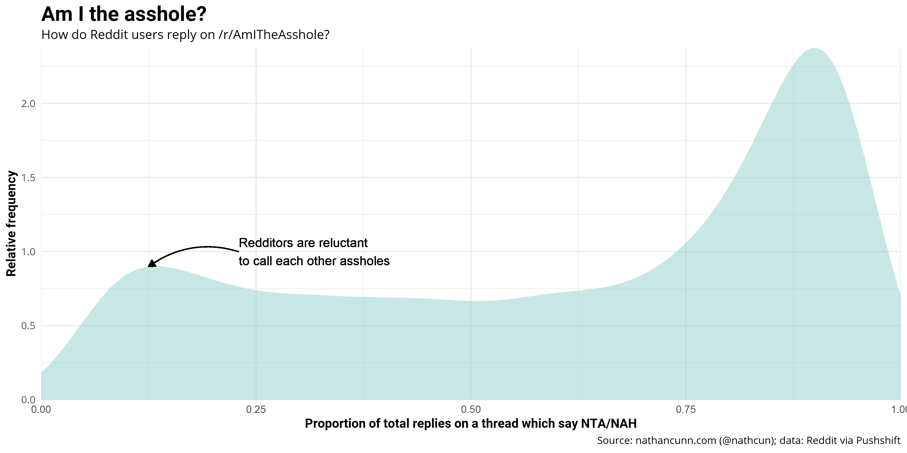
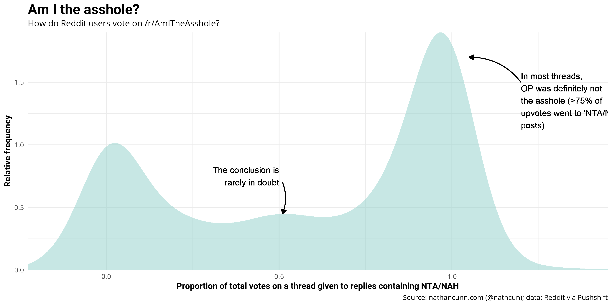

The Reddit community [/r/AmITheAsshole](http://www.reddit.com/r/amitheasshole) has a simple premise: users describe a particular situation in their lives and others respond with their opinion of whether the original poster (OP) was the asshole in the situation. A vote is made using a set of initialisms:
  - **NTA** - _'not the asshole'_: the OP was not the asshole in the situation, while the others in the situation were;
  - **NAH** - _'no assholes here'_: nobody in the particular scenario is an asshole;
  - **YTA** - _'you're the asshole'_: the OP is the asshole, while the others are not;
  - **ESH** - _'everyone sucks here'_: the OP, and all others involved in the story are assholes.

The community usually leads to some interesting stories, most interestingly when completely oblivious assholes show up and are destroyed in the comments, such as [the asshole who stole a homeless person's dog](https://www.reddit.com/r/AmItheAsshole/comments/ar75he/aita_for_taking_a_homeless_persons_dog/), or [the asshole who wouldn't take his girlfriend out because he preferred her cooking.](https://www.reddit.com/r/AmItheAsshole/comments/b7vz7m/update_aita_for_very_rarelyalmost_never_wanting/) While those posts are entertaining, I always find it more intriguing when there's some debate over the conclusion, yet I rarely seem to come across such controversy.

In order to assess how frequently the conclusion is up for debate, I grabbed all the comments made to /r/AmITheAsshole since the start of the year. In all, about 1.5 million comments were made, and from these I extracted just those which cast a vote using the initialisms above. Then, for each post, I calculated what proportion of the related comments claimed the OP was an asshole (comments containing either NTA or NAH) and similarly for comments claiming OP was the asshole (either YTA or ESH). These two values will be complements for each post as I'm only looking at comments which cast a vote. In order to smooth out some variation I'm only considering posts which have >20 replies. The distribution of the proportion of NTA/NAH posts can be seen below:

It seems /r/AmITheAsshole conforms to Betteridge's Law of Headlines---any article whose headline is a question can be answered with the word 'no'---as in most posts the OP is almost certainly not the asshole, evidenced by the mode at around 80-90%. Given the definitive nature of the conclusions, I would've expected a similar mode at 10-20% (suggesting 80-90% of comments claiming OP was the asshole), but this isn't evident in the data.

At first I thought the assholes were simply self-aware enough not to expose themselves to public scorn, or similarly many people post stories from their point of view deliberately minimising their asshole-ish behaviour. But, then I thought maybe this just doesn't align with how people use Reddit. Perhaps Redditors are simply less likely to give scathing responses to strangers they've never met? To check this out, I examined how Redditors distribute their upvotes on replies, as upvoting a post that the OP is an asshole is an anonymous equivalent to making the reply yourself.

The issue with measuring upvotes is the data I have only includes the net score---
the difference between upvotes and downvotes. This poses a couple of issues. First of all,
this net score can be negative and so viewing the proportion of total upvotes/downvotes is
a little peculiar---imagine creating a pie chart in which one slice represents minus 20%.
A related issue is that the fuller picture we gain still is not the complete picture. Consider a scenario with just 1 response stating YTA with 100 upvotes and 99 downvotes, giving a net +1 upvote. It would appear that YTA is 100% of the responses, as opposed to just over 50%. This is unlikely to be the manner in which people vote, however, as people _ought_ not to downvote simply because they don't share the same view. So, while this isn't a particularly likely scenario, it's always a useful exercise to consider the potential pitfalls of your data.

This gives a clearer picture, while OP is still most likely not the asshole, if they are the asshole, they're definitely the asshole with non-definitive conclusions occurring relatively rarely.

### Data and tools
I scraped the data for this post from [Pushshift](http://www.pushshift.io) using R. I wrote a small, very basic, [R package](https://github.com/nathancunn/pushshiftR) for this purpose which others may find useful. The plots were made using ggplot2 in R.
