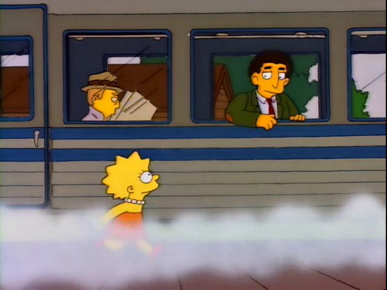
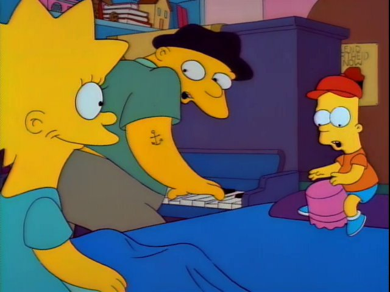
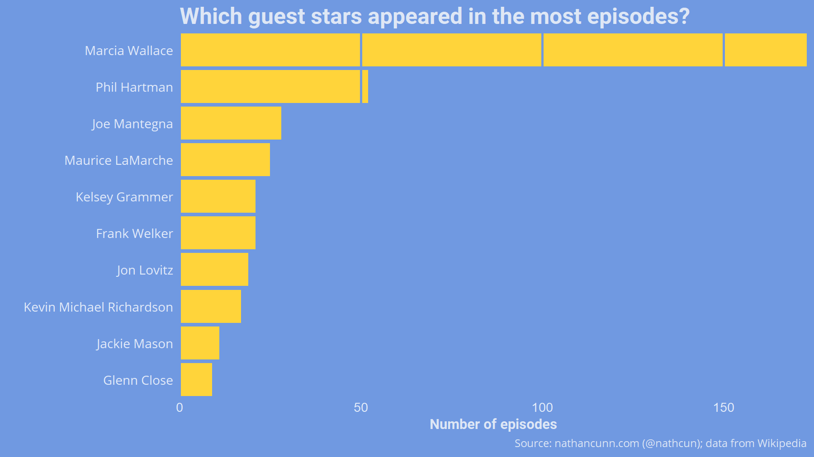
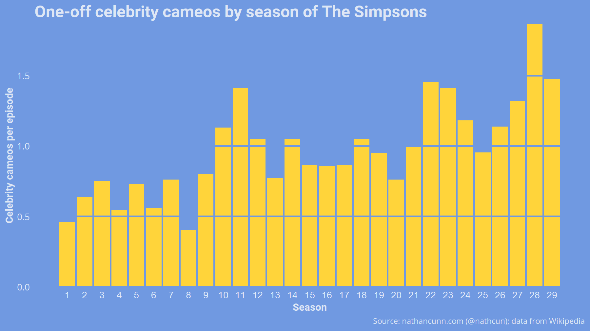

[Last year](http://www.nathancunn.com/2018-10-21-simpsons-writers/), I wrote about the evolving nature of the writing staff as a possible reason for post-golden-age decline of _The Simpsons_. While I'd hesitate to argue a causal relationship, the decline in episode ratings did appear to correspond roughly to a change in the writing staff. Nevertheless, there are other potential causes for the downfall, in particular I'm going to focus on something which, to me, sums up the post-golden-age: pointless celebrity cameos.


### _Not all cameos are bad..._
Celebrity appearances aren't exclusive to the post-golden-age, nor are they necessarily a bad thing. Some of the classic stories focus primarily on a one-off character voiced by a celebrity. A particularly salient example is _Lisa's Substitute_, in which Lisa develops a crush on her substitute teacher, Mr Bergstrom voiced by Dustin Hoffman. The episode is equal parts touching and hilarious, and Hoffman's performance has been touted as one of [The Simpson's greatest guest appearances](https://ew.com/gallery/springfield-dreams-16-great-simpsons-guest-voices/). While the episode didn't [spare reference to the actor behind the voice](https://www.youtube.com/watch?v=n4FLPLSy1WU) you'd be forgiven for thinking that Mr Bergstrom was, in fact, an authentic Springfieldian.



### _...but some are really bad_
But, just as the train sped Mr Bergstrom from our lives, so it was used to bring in perhaps the most egregious example of the celebrity cameo: Lady Gaga. At [4.3/10 on IMDb](https://www.imdb.com/title/tt2403733/), _Lisa Goes Gaga_ is, _by far_, the lowest rated episode of the show---significantly lower even than _All Singing, All Dancing_, the musical clip show episode which I can only assume was some sort of cruel experiment from the writers. The gist of _Lisa Goes Gaga_ is: Lisa feels down; Lady Gaga _somehow_ senses this, derails the train she's on to help Lisa out; the whole issue is wrapped up with a musical number from the celebrity guest.

Despite how outlandish this sounds, it's essentially the plot of _Stark Raving Dad_, the classic, if currently maligned, episode in which Homer meets a man in a mental asylum who claims to be Michael Jackson. This episode, interestingly, is rated 8.6/10 on IMDb at the time of writing, exactly double that of _Lisa Goes Gaga_.



### _What makes a good cameo?_
So, why such love for one episode and not the other? Surely it's not just that the episode feels like a rehash of an old concept? I'd argue that it comes down to the perceived relationship between the show and the celebrity. In _Stark Raving Dad_ and _Lisa's Substitute_ the guest stars seemed to be of secondary importance to the plot of the episodes. It's almost as if the writers began writing an episode about Homer being in a mental asylum and a patient believing he was Michael Jackson was the natural progression of things. In _Lisa Goes Gaga_, on the other hand, the episode feels more like it exists solely as a vehicle to get Lady Gaga on the show. This contrast is backed up by the fact that Lady Gaga plays herself, while neither Michael Jackson nor Dustin Hoffman _technically_ play themselves in their respective episodes; their names aren't even listed in the credits.


### _Who were the main guest stars?_
While I've only mentioned a few episodes here, I think there's been a general trend in the show of increasingly present, and increasingly pointless, celebrity cameos. Data on this are available from Wikipedia [here](https://en.wikipedia.org/wiki/List_of_The_Simpsons_guest_stars) and [here](https://en.wikipedia.org/wiki/List_of_The_Simpsons_guest_stars_(seasons_1%E2%80%9320)). We can read them into R using `rvest`.

``` r
library(rvest)
library(tidyverse)
guest_stars <- read_html(url) %>% # Specify url as the Wikipedia page
  html_table(fill = TRUE) %>%
  .[[2]]
```

However, many of the guest appearances listed aren't exactly the kind of guests I'm interested in. To see this, we can look at which celebrities appeared in the show most frequently.

``` r
guest_stars %>%
  count(`Guest star`) %>%
  arrange(desc(n)) %>%
  top_n(10)
```


None of these are what I would consider a _guest_ appearance: Marcia Wallace racked up 173 appearances as Mrs Krabappel; Phil Hartman played Lionel Hutz and Troy McClure; and even Glenn Close at the bottom of the top ten made 11 appearances as Mona Simpson. Each of these are characters in their own right and not the kind of pointless cameos that bother me. I'm going filter the data to focus instead on one-off celebrity appearances.

``` r
guest_stars %>%
  group_by(`Guest star`) %>%
  mutate(n_apps = n()) %>%
  ungroup() %>%
  filter(n_apps == 1) %>%
  select(-n_apps)
```



Observing the trend in one-off appearances, It's interesting to see the first season to cross the one-celebrity-per-episode threshold is season ten, which I've previously found to be [the season the golden age ended](http://www.nathancunn.com/2017-10-26-simpsons-decline/). Looking more closely at the precise end of the golden age (S10E11 - _Wild Barts can't be broken_) there are three guest stars listed: Marcia Wallace as Edna Krabappel, Cyndi Lauper as herself, and Franklin D. Roosevelt as himself (from archives). In constrast, S10E12 - _Sunday, Cruddy Sunday_, the first post-golden-age episode, has no fewer than **eight** celebrity cameos, seven of which appear as themselves.

 Although the number of celebrity appearances dipped below 1.0 again afterwards, it's clear to see that there was a tendency for more celebrity cameos post-golden-age than during; the golden age averaged 0.65 celebrities-per-episode while the post-golden-age came in at 1.13.

 I should note here the bias in these numbers: it may simply be the case that there are more one-off celebrities in the later seasons because they just haven't had the chance to reappear on the show yet. While this doesn't exactly address the problem, the trend is similar if we instead consider celebrities making other numbers of appearances.

As I said already though, celebrity cameos aren't inherently bad. My issue with them arises when the appearance serves no purpose other than having a celebrity appear on the show. Appearances such as Lady Gaga's, Tony Blair's appearance to greet The Simpsons at the airport (why?), Glen Hansard's appearance to sing a verse of a song because The Simpsons are visiting Ireland, or any of the seven appearances from _Sunday, Cruddy Sunday_. It all comes down to celebrities popping up and playing themselves for no reason.


We can filter these out fairly straightforwardly by looking for cases where the character played includes "self" or "selves".

``` r
guest_stars %>%
  filter(str_detect(`Role(s)`, "self|selves"))
```

The trend is pretty much as before, with the golden age having 0.33 self-appearances per episode, compared with 0.59 post-golden-age. The show never quite broke the one-self-appearance-per-episode threshold, peaking at 0.86 in season 14.


_The data used here were sourced from Wikipedia, analysed in R, plotted using ggplot2. The Simpsons images come from [Frinkiac](http://www.frinkiac.com)._

If you enjoyed this, you might be interested in my other Simpsons-related posts:
  - [When did the golden age of The Simpsons end?](http://www.nathancunn.com/2017-10-26-simpsons-decline/)
  - [What is the best/most quotable Simpsons episode?](http://www.nathancunn.com/2018-01-21-best-simpsons/)
  - [Who is the main side character in The Simpsons?](http://www.nathancunn.com/2017-07-16-simpsons-characters/)
  - [Why did the golden age of The Simpsons end?](http://www.nathancunn.com/2018-10-21-simpsons-writers/)
  - [How Ned got Fland-diddly-anderised](http://www.nathancunn.com/2019-03-07-simpsons-flanderisation/)
