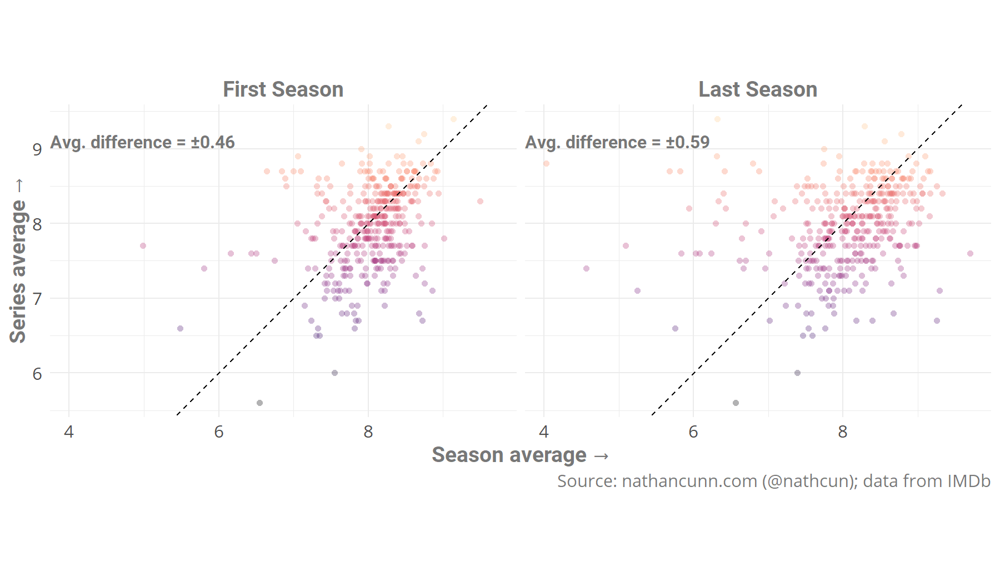
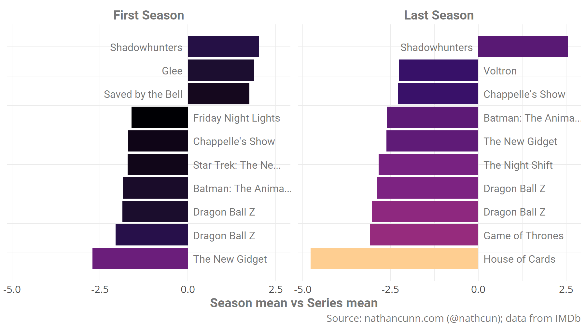

In _Thinking Fast and Slow_ Daniel Kahnemann and Amos Tversky outlined an experiment in which they asked participants to place their hand in a bowl of cold water. In one trial they were asked to remove their hand after 60 seconds and asked to rate their pain. In the other, they endured the same 60 seconds, but also an additional 30 seconds in which the water was marginally less cold. The total discomfort experienced in the second experiment is objectively greater, being the sum of the original experiment plus some additional---albeit more moderate---discomfort. Despite this, participants rated the second experiment as causing less distress, choosing to repeat it over the first. So, contrary to conventional knowledge, it's not first impressions that matter, it's last impressions.

This got me thinking about TV, of course. One of the biggest TV productions of recent years, Game of Thrones, ended to almost universal disappointment. Has the sour taste left by the final season tainted the rest of what was, at times, an excellent show? Or with TV shows, are first impressions more important than final impressions?



It turns out the opening season of a show is typically rated _marginally_ closer to the overall show's average, than the final season is. It appears as though we are slightly more forgiving of a dud final season when it comes to forming our overall opinion of a show. It's interesting that in both cases, we tend to rate the show overall as better than either season. This may be that shows typically have better middles than ends, or that it's easier to gloss over the bad when we look to view the show as a whole. Indeed if we look at the shows with the largest discrepancies between the season average and the series average, the majority show the season being poorer than our memory of the show itself. The largest negative discrepancies also belong to the final seasons, reinforcing the idea that we tend to be more forgiving of final seasons.




## Data
I gathered the data from [IMDb](https://datasets.imdbws.com/). The data needed are spread across a couple of different tables: `title.ratings`, `title.episode`, and `title.basics`, so they all need to be downloaded and extracted on your machine. They can be read into R using the `tidyverse` package:

```r
library(tidyverse)
ratings <- read_delim("~/../Downloads/title.ratings.tsv/data.tsv", delim = "\t", na = "\\N")
basics <- read_delim("~/../Downloads/title.basics.tsv/data.tsv", delim = "\t", na = "\\N")
episode <- read_delim("~/../Downloads/title.episode.tsv/data.tsv", delim = "\t", na = "\\N")
```

Next we need to extract just the TV series from basics, as it contains episodes, films, and others. We'll then add the ratings for each of these shows by joining the `ratings` table. This also gives the number of votes, which we want to filter so that we only keep shows where >100 ratings were made, so that the results aren't being distorted by small shows with unrepresentative average ratings.

``` r
tvSeries <- basics %>%
  filter(titleType == "tvSeries") %>%
  left_join(., ratings, by = "tconst") %>%
  filter(numVotes >= 100)
```

Next, we need to select the episodes corresponding to TV shows in `tvSeries` table, and then merge the episodes data with the series data. And finally we'll remove any shows where an episode in the first or last season has fewer than 100 votes.

``` r
eps <- episode %>%
  filter(parentTconst %in% tvSeries$tconst) %>%
  left_join(., ratings, by = "tconst") %>%
  # We need to rename some variables as
  # tconst means episode ID in episode table
  # but tconst means series ID in tvSeries table
  select(epconst = "tconst",
         tconst = "parentTconst",
         epRating = "averageRating",
         epVotes = "numVotes",
         seasonNumber,
         episodeNumber) %>%
  # Join with tvSeries to get series rating
  inner_join(., tvSeries, by = "tconst") %>%
  na.omit() %>%
  group_by(tconst, seasonNumber) %>%
  # Get minimum votes for a single episode in a season
  mutate(min_votes = min(epVotes)) %>%
  ungroup() %>%
  group_by(tconst) %>%
  mutate(max_season = max(seasonNumber, na.rm = TRUE),
         last_season = (seasonNumber == max_season),
         pilot = seasonNumber == 1) %>%
  ungroup() %>%
  # Remove all but the first and last seasons
  filter(max_season > 1,
         last_season | pilot) %>%
  na.omit() %>%
  group_by(tconst) %>%
  # Remove shows where any episode had fewer than 100 ratings
  mutate(min_votes = min(min_votes)) %>%
  filter(min_votes >= 100)

```
