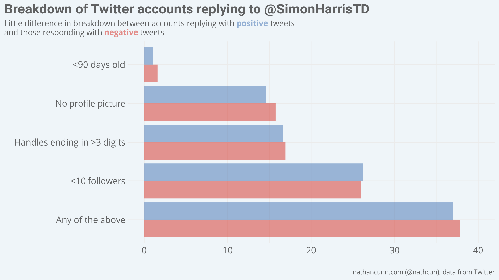
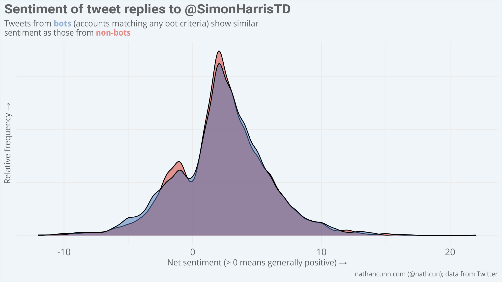
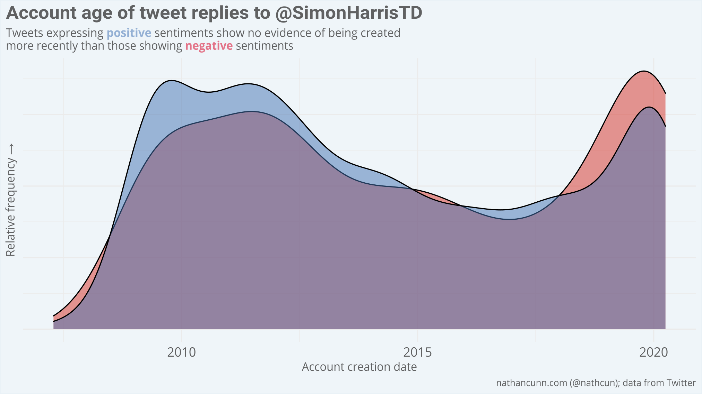

There's been one thing dominating my Twitter feed lately, popping up everywhere no matter how much I try to avoid it. I'm talking, of course, about the army of Twitter bots that Fine Gael have employed to post positive responses to each of their tweets.

The claim has been doing the rounds on Twitter the last few days, not just confined to the darkened corners of the internet, with some journalists even promoting it.

<blockquote class="twitter-tweet"><p lang="en" dir="ltr">Even Twitter’s bots and sock puppets are putting on the green jersey to support the government. <br><br>Read the 20+ supportive comments beneath this and then note their join date, followers, handles with numbers etc. <a href="https://t.co/3PMqcDkZNL">https://t.co/3PMqcDkZNL</a></p>&mdash; Philip Boucher-Hayes (@boucherhayes) <a href="https://twitter.com/boucherhayes/status/1244886271710892039?ref_src=twsrc%5Etfw">March 31, 2020</a></blockquote> <script async src="https://platform.twitter.com/widgets.js" charset="utf-8"></script>

Along with Philip Boucher-Hayes, most of those making the claim give some variation of the following as their criteria for deeming an account to be a Fine Gael bot:
  - Recent join date
  - No profile picture
  - Account handle ending with a series of numbers
  - Few followers
  - Positive comments under Fine Gael tweets

A cursory glance at the replies under the Simon Harris tweet do indeed turn up a number of such accounts, so the evidence feels compelling. However, I find the whole thing extremely cynical, an easy way to just rubbish the opinions of anyone with whom you disagree. Regardless, given the added gravitas we pay to the opinions of journalists, shouldn't we expect that such claims be accompanied with some actual, non-anecdotal evidence?

I analysed just under 4,500 replies made to tweets from @SimonHarrisTD. I gathered the data using the R package `rtweet`. The data gathered includes: account join dates; profile picture URLs; Twitter handles; follower counts; and, of course, the text of the tweet itself.
Following the Twitter experts, I identify as bots any accounts who satisfy any of the following:
  - Joined in the previous 90 days
  - Have no profile picture (their profile picture is recorded as `default_profile_normal.png`)
  - Have a Twitter handle ending in three or more digits
  - Have 10 or fewer followers
  - Satisfy any of the above criteria

I create these flags as follows:

``` r
harris_tweets %>%
  mutate(number_flag = str_detect(screen_name, ".+[0-9]{3}$"),
         avatar_flag = str_detect(profile_image_url, "default_profile_normal.png"),
         follower_flag = followers_count <= 10,
         date_flag = lubridate::now() - account_created_at <= 90,
         bot_flag = number_flag | avatar_flag | date_flag | follower_flag)

```

In order to gauge how positive or negative each of the replies was, I used the R package `tidytext` to measure the sentiment of each tweet. A basic description of this approach is that each word is assigned a score from -5 to +5, from very negative to very positive using the `AFINN` lexicon. For example, the word 'good' would be worth +3. The overall sentiment of a tweet is then the sum of these values for every word in the tweet. This is a limited approach as it only looks at words in isolation and so can't understand the context in which the word is used.

``` r
harris_tweets %>%
  unnest_tokens(word, text) %>%
  anti_join()
  inner_join(get_sentiments("afinn")) %>%
  group_by(status_id) %>%
  summarise(sent = sum(value)) %>%
  inner_join(harris_tweets)
```


Before reading on, I would recommend you consider what you expect to be the output of this analysis. How pervasive do you believe the Fine Gael bots are? How much more positive are their responses than those from everyone else? What evidence would it take for you to change your mind?


## How pervasive are the bots?
Having identified candidates for bots, what proportion of the replies to @SimonHarrisTD are actually from these candidates? If we expect that the positive comments are mostly coming from bots, and that our definition of a bot identifies bots accurately, then we should expect a greater proportion of those making positive comments to satisfy one or more of the criteria. However, there's very little difference between the two. In fact, the data suggest that accounts leaving negative tweets are slightly more likely to satisfy at least one of the bot criteria.




## Are the bots more positive?
A slightly different way of looking at this would be to ask: do the bots behave differently from us? Do they heap their praise more readily on Fine Gael than do the rest of us? You might expect these bot accounts to be much more glowing in their replies. Perhaps there are also anti-Fine-Gael bots who are constantly replying with negative comments? In which case, you might expect the bots to make much more polarised tweets.

However, the accounts identified as bots because their Twitter handles end in multiple digits behave almost exactly the same as the other accounts:


As do accounts with no profile picture:


In fact, the same holds for accounts matching _any_ of the bot criteria:



There's also no evidence that the accounts positing positive messages were created more recently than other accounts:




## Why all the suspicious accounts then?
So, if there's no conspiracy happening, then why is everyone so suspicious? The pretext of the suspicion is ludicrous: Fine Gael have invested money in bot Twitter accounts capable of generating grammatically correct and contextually sensible messages of support, but can only generate cookie cutter Twitter handles, can't add profile pictures and aren't capable of following each other. Not only that, but Fine Gael ramped up their efforts to do so _after_ a general election and during a global pandemic (apparently in case people deviate to team coronavirus).

Another potential reason for the suspicious Twitter handles is much more benign: **when you set up a Twitter account, you are never asked to choose a Twitter handle.** Instead, you are asked your name and your email/mobile number and Twitter then generates your account. It automatically assigns you a handle consisting of the first seven letters of your name, followed by a sequence of eight random digits.

The reason for all the recently created accounts with no profile pictures, on the other hand, might be a little more troubling, as anyone who has had to suffer an onslaught of awful memes from their parents will be well aware: older generations are discovering Twitter. With the current global situation, older generations are having to become familiar with newer technology to keep in touch with their family and to keep up-to-date with the spread of COVID19. These new users are of the demographic which would typically have voted Fine Gael so it makes sense to see them popping up en masse under tweets from TDs.

So, don't just offhandedly dismiss any positive comments under tweets from Fine Gael. Is it possible that they have bots making positive comments under their tweets? Absolutely. However, based on the bot criteria people are working with at the minute, the evidence is not particularly compelling. It's much more probable that there's been a surge of Twitter accounts from older demographics, who have traditionally supported Fine Gael. That's not to mention younger people. While I doubt many have forgiven Fine Gael for the many issues we had coming into this crisis, I think many agree that, given the enormity of the task at hand, they're not doing a bad job.

**Disclaimer:** If it somehow biases your perception of this analysis, I am not _in any way_ affiliated with Fine Gael or any of the other parties in Ireland.
