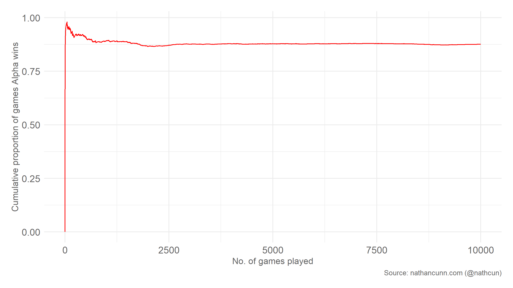

In this week's New Scientist, they posed the following puzzle:

Alpha and Betty are playing a game. In front of them are 8 digestive biscuits
and 4 Rich Tea biscuits. On their turn they can choose to either: take any
amount of either biscuit, or take the same amount of both. They each takes
turns as such, and the player who takes the last biscuit wins and gets to
keep all of the biscuits.
Alpha goes first; what should they do?

At the risk of wielding a hammer on a thumb tack, this seems to me like a perfect
opportunity for a gentle introduction to reinforcement learning. If you're unfamiliar,
the idea of reinforcement learning is for a computer to learn a strategy for
performing some task by rewarding good performance and training the machine to maximise
the reward gained, i.e. reinforcing positive actions.

The basic plan of attack for this puzzle:
  * Create a game environment which keeps track of the number of each biscuit remaining
  * Create a player who can: read the current state of the game; evaluate
  potential actions; perform an action; and, after a game has been played update
  their evaluation of the game states based on whether or not they were successful
  * Initialise two such players and let them play against one another until they
  learn optimal strategies.

I'm going to code this in Julia, rather than my usual R. So, this will also serve
as a gentle introduction to Julia. If you're familiar with R
or Python, the syntax shouldn't feel too alien.

## The game environment
The first step is to create a structure for our game environment. This really is nothing
more than a fancy tuple or array, but this kind of approach is what you're likely
to use if you want to play a more complicated game, so it's useful to do so here
also.

``` julia
mutable struct Environment
    digestives::Int
    richTeas::Int
    Environment() = new(8, 4)
end
```

Line-by-line: we are defining a data structure of type `Environment` which can
only contain two different values: one is an integer
denoting how many Digestives we have; the other how many Rich Teas we have.
As the structure is mutable, we can reach into an `Environment` object and change
how many of each biscuit we have, but we can't keep track of how many, say, cookies
we have without redefining our data structure.
The function `Environment()` specifies that the data structure should be initialised
with 8 Digestives, and 4 Rich Teas.

R and Python users may be unfamiliar with the `::Int` specification which forces
the count for each biscuit to be an integer. This is entirely optional, but it can
help with performance if the compiler knows what type of data to expect, as well as
helping to prevent issues where your data end up taking on an unexpected format.

Let's check that our data structure does what we expect of it

``` julia
env = Environment()
env.digestives # Should return 8
env.digestives = 3 # We now have 3 Digestives
env.digestives = "8" # Should return an error
```


Next, we're going to define two functions: one which checks is the game over; and
one which resets the playing environment. As before, these probably don't need to
be functions, but they're useful to use in more complicated examples and also help
introduce dynamic dispatch, which is one of Julia's most interesting features.

First, the function to check if the game is over. The winning condition is that
there are no biscuits left, so we only need to check are there
any biscuits left and return `true` if so.

``` julia
function game_over(env::Environment)
    return env.digestives == env.richTeas == 0
end
```

Note the only argument to this function is `env::Environment` meaning this function
will return an error unless it is called with an object of the type `Environment`
we previously defined.

Next, we need to reset the environment to our starting configuration once a game is finished.
Of course, rather than changing these values we could just create a new `Environment`
and the outcome would be identical. Performance-wise you're likely to be better
off just to change these values, rather than construct a whole new environment
every time, particularly when your gaming environment is more complex than what
we are using here.

``` julia
function reset!(env::Environment)
    env.digestives = 8
    env.richTeas = 4
end
```

Note the `!` at the end of the function name. This is Julia convention for functions
which mutate their inputs.  In this case, the `env` we pass into this function will
have its values for Digestives and Rich Teas changed.

``` julia
env.digestives = 3
reset!(env) #
env.digestives # Should return 8

env = reset!(env) # This won't work as reset!() does not return a value.
```


# The player
Next, we need to define a data structure to characterise our players.
Alpha and Betty will both be constructed the same.
As I described previously, the players will have their own measure of how _good_
a particular state is, which they will use to decide which actions to take.

To be precise, what each player is actually learning is the value of them making a
move which will results in a particular state, rather than the value of the state
itself. This distinction is because the value of there being 0 Digestives and 0 Rich Teas is different depending on who made the move that ended the game there.

In order to encourage the players to explore their options, we'll adopt what's called an ϵ-greedy approach. A greedy approach is one where players take the action that gets them
immediately to the available state with the highest value. In an ϵ-greedy approach, the players take an entirely random move a small proportion, ϵ, of the time. You'll often hear
this desire to consider other options described as the exploration-exploitation
trade-off where you want your player to balance _exploiting_ what they've learned
with _exploring_ to learn new things.

As before, we'll create a data structure for each player. One really handy thing
in Julia is the ability to assign values to Greek letters like α. Coming from a
statistics background this makes a lot of my code extremely more readable and more
readily comparable to the underlying equations being represented.

``` julia
mutable struct Player
    values::Array
    history::Array
    α::Float64
    ϵ::Float64
    reward::Int
    Player() = new(ones(Float64, 9, 5),
                      [],
                      0.5,
                      0.05,
                      0)
end
```

This is much the same as our gaming environment. The values field is a 2-dimensional
array where entry [i, j] gives the estimated value of taking a move which results in
i + 1 Digestives (note: indices in Julia begin at 1, not 0),  and j + 1 Rich Teas.

Note that the array of values is constructed using the function `ones()`
which means every value will be `1.0` to start, which is the best possible value
that any state can have. While this might seem unusual, the use of optimistic
initial values is a useful trick to help encourage the player to try out moves
they haven't considered previously. Every state is good until proven otherwise.

The history slot for our players will keep track of the state of the game after
their moves. The learning rate α is initialised to 0.5 and will be used to update
the value estimates, which we'll touch on later. The exploration rate, ϵ, is initialised
to 0.05, meaning a random move will be performed in 5% of moves.

While we want our players to learn how to play the game for themselves, we need to
at least give them some constraints on what moves they can make. Recall from the
puzzle, on each turn a player can take one or more Digestives, one or more Rich Teas,
or one or more of each, but obviously cannot take more biscuits than are remaining
on the table.

The function `get_legal_moves()` does what it claims to: lists moves
which are allowed given the current state of the game. It returns a tuple giving
the index in the players values matrix of all allowed moves. For example, if there
are one remaining Digestive and no Rich Teas, the return will be `(1, 1)` which
corresponds to there being zero Digestives and zero Rich Teas remaining (remember
indices in Julia begin at 1).


``` julia
function get_legal_moves(env::Environment)
    return [[(x, env.richTeas + 1) for x in 1:(env.digestives)]..., # Pnly taking Digestives
           [(env.digestives + 1, x) for x in 1:(env.richTeas)]..., # Only taking Rich Teas
           [(env.digestives + 1 - x, env.richTeas + 1 - x) for x in 1:min(env.digestives, env.richTeas)]...] # Taking the same amount of both
end
```

If you're coming from a purely R background the use of list comprehensions may be
a little unfamiliar, but they're fairly intuitive: `[x for x in 1:3]` yields
`[1, 2, 3]`.
The only other point of confusion may be the use of the _splat_ operator `...`
which works here like `unlist` in R in that it returns the individual elements of
the arrays we create rather than the arrays themselves, meaning the return value
is an array of tuples, rather than an array of arrays.
Let's check this does what we expect.

``` julia
env = Environment()
env.Digestives = 1
env.RichTeas = 1
get_legal_moves(env)
# (1, 2) Take 1 Digestive
# (2, 1) Take 1 Rich Tea
# (1, 1) Take 1 of each
```

Knowing what moves they can make, the player either chooses from these randomly,
or consults their value estimates and performs the move which gives them the greatest
value.

``` julia
function move!(env::Environment, player::Player)
    legal_moves = get_legal_moves(env)
    if rand() < player.ϵ
        # Move randomly
        move = sample(legal_moves)
    else
        # Pick best move
        move = legal_moves[argmax([p1.values[move...] for move in legal_moves])]
    end
    # Update the environment
    env.digestives = (move[1] - 1) # -1 because of 1-indexing in Julia
    env.richTeas = (move[2] - 1)

    push!(player.history, (env.digestives + 1, env.richTeas + 1)) # Add game state to history
    return
end
```

In order to use the function `sample()` you'll need to load the package
`Distributions` by adding `using Distributions` to the start of your
file.
If the actions aren't drawn randomly, the players select the best action
using `argmax()` which returns the index of the greatest value of an array.
Having selected an action, the player updates the number of biscuits left in play, and
adds the outcome to their own history as an array using the function `push!()`.
Recall the convention of naming functions with a `!` if they mutate their arguments.

Note that the players update their history when they take a move, and so don't
keep track of the state of the game after the other player's turn. Recall that the
terminal state where---there are no biscuits remaining---is valuable only if you
are the player to get there.

### Updating value estimates
After each game, the winning player is assigned a reward of 1 and both players
then go back through their record of the game states and update the value of the
moves they played, $V(s)$, as follows

$$
V(s)_{new} = V(s)_{old} + \alpha \times (V(s + 1)_{new} - V(s)_{old})
$$

where $V(s)$ is the value of taking a move which led to state s, $V(s + 1)$ is
the value of the move which led to the following state, and α is the learning-rate.

Note that as $V(s)\\_{new}$ depends on $V(s+1)\\_{new}$, the value estimates need to
be updated in reverse order. $V(s+1)$ for the final move played is the reward
received for winning/losing the game.


In all, I hope this is fairly intuitive: each player plays a game, and depending
on whether or not they won, they update the values they assign to the states of
the game that led to the win/loss.

``` julia
function update_values!(player::Player, env::Environment)
    reward = player.reward
    for state in reverse(player.history)
        reward = player.values[state[1], state[2]] + player.α * (reward - player.values[state[1], state[2]])
        player.values[state[1], state[2]] = reward
    end
end
```

Next, we want to reset the game-specific information for each player once a game
is finished. We only want to reset the players history for that game and the reward
earned.

``` julia
function reset!(player::player)
    player.history = []
    player.reward = 0
end
```

Recall that we used the exact same function name to reset the environment earlier.
This is a really simple demonstration of multiple dispatch in Julia. This
function will perform a different task if the argument passed to it is of type
`Player` or type `Environment`.


### Putting it all together
This function takes care of alternating between the two players and letting them
move, assigning a reward to the winner and then letting the players update their
values. I'm choosing to return a value of 1 if player 1 wins, and 0 otherwise to
keep track of which player is having the better luck. The value `verbose` will dictate
whether the environment is printed out after every move.


``` julia
function play_game!(p1::Player, p2::Player, env::Environment, verbose = false)
    current_state = (8, 4)
    current_player = nothing

    while game_over(env) == false
        if current_player == p1
            current_player = p2
        else
            current_player = p1
        end
        move!(env, current_player)

        if verbose
            player = current_player == p1 ? "Alpha" : "Betty"
            println(player,": ", current_state, "->", (env.digestives, env.richTeas))
            current_state = (env.digestives, env.richTeas)
        end
    end

    if verbose
        player = current_player == p1 ? "Alpha" : "Betty"
        println(player," wins")
    end

    current_player.reward = 1
    update_values!(p1, env)
    update_values!(p2, env)
    reset!(env)
    reset!(p1)
    reset!(p2)
    if current_player == p1
        return 1
    else
        return 0
    end
end
```

Now, let's play a game.

``` julia
p1 = Player()
p2 = Player()
env = Environment()
play_game!(p1, p2, env, true)
# Alpha: (8, 4)->(0, 4)
# Betty: (0, 4)->(0, 0)
# Betty wins
```

Alpha picked an obviously bad strategy here, but that's to be expected because it
hasn't learned how to play yet. Let's let Alpha and Betty play each other 10,000
times and let them learn how to play each other. Don't worry, this will only take a
few seconds.

``` julia
p1 = Player()
p2 = Player()
env = Environment()
play_game!(p1, p2, env, true)
iters = 10000
out = Vector{Int}(undef, iters)
for i in 1:iters
    out[i] = play_game(p1, p2, env, false)
end
```

Looking at the cumulative proportion of games won by Alpha, it's clear that they
have very quickly learned a winning strategy.



To find out what this winning strategy is, let's set Alpha's ϵ to zero and see how
a game plays out.

``` julia
alpha.ϵ = 0
play_game(alpha, betty, env, true)
# Alpha: (8, 4)->(7, 4)
# Betty: (7, 4)->(7, 2)
# Alpha: (7, 2)->(1, 2)
# Betty: (1, 2)->(1, 1)
# Alpha: (1, 1)->(0, 0)
# Alpha wins
```

So, surely the longest-winded answer to a simple puzzle: Alpha's optimal opening
move is to take one Digestive. The winning move, it seems, is to finish your move
with two of one biscuit remaining and one of the other. From this point, you cannot
lose the game, unless you try. Other starting moves leave open the possibility that
Betty gets to such a move.

Hopefully you've learnt something from this, even if it's just how to win at a game
you'll certainly never play. You might consider the impact of changing some variables
in the code: what happens if the learning rate, α, is larger/smaller? what if you
alter the exploration-rate, ϵ, or give the players different exploration rates?
