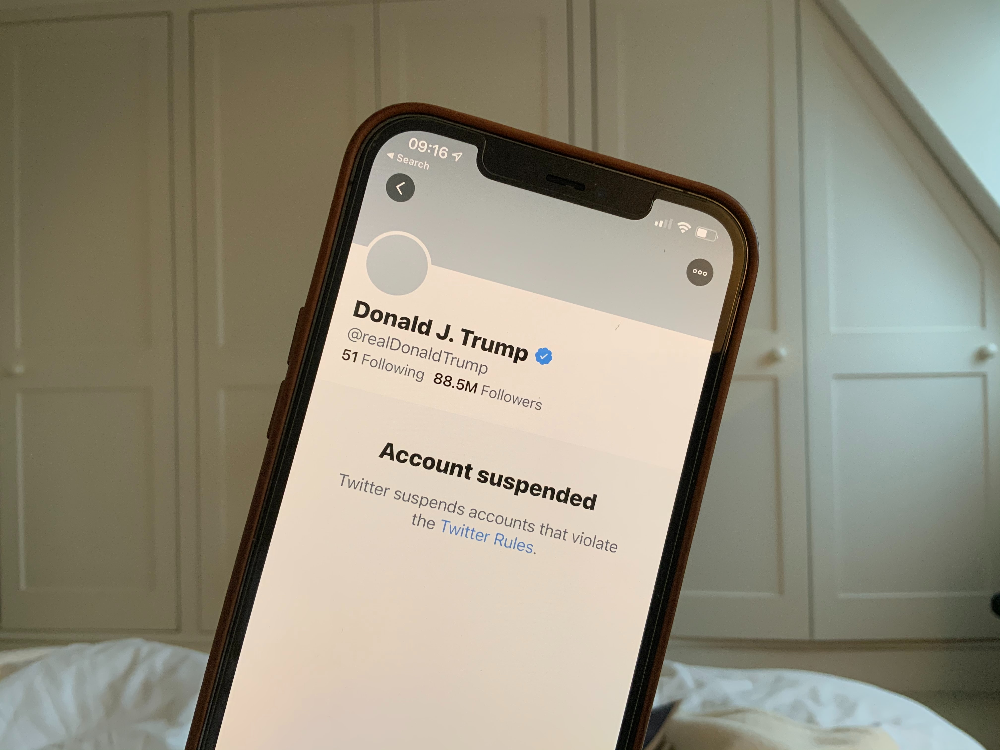
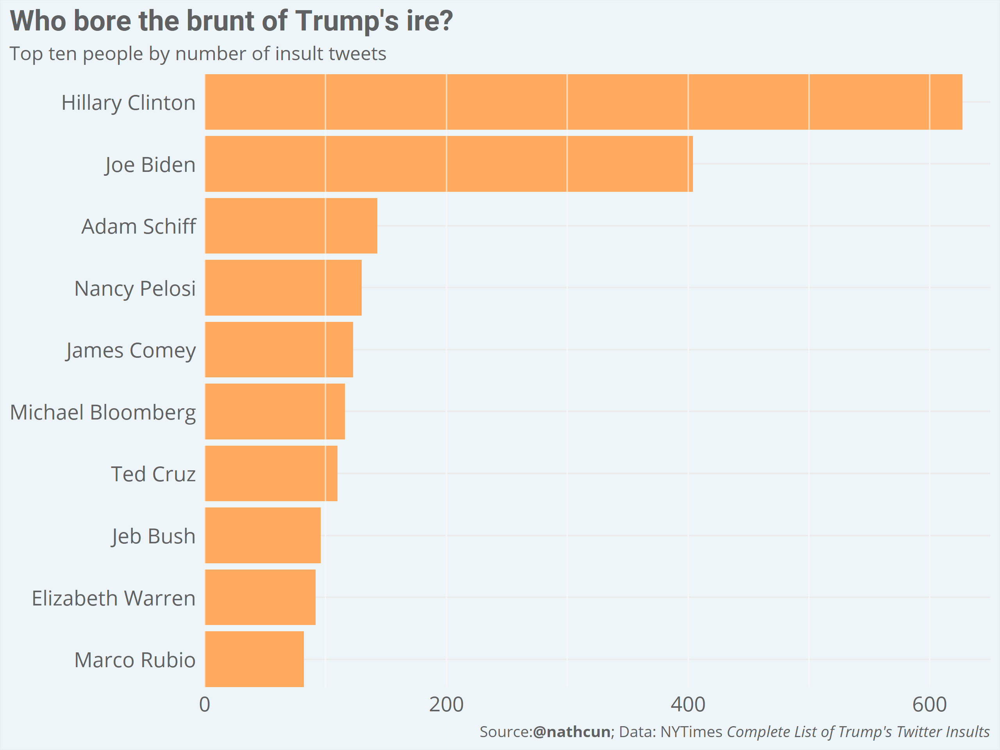
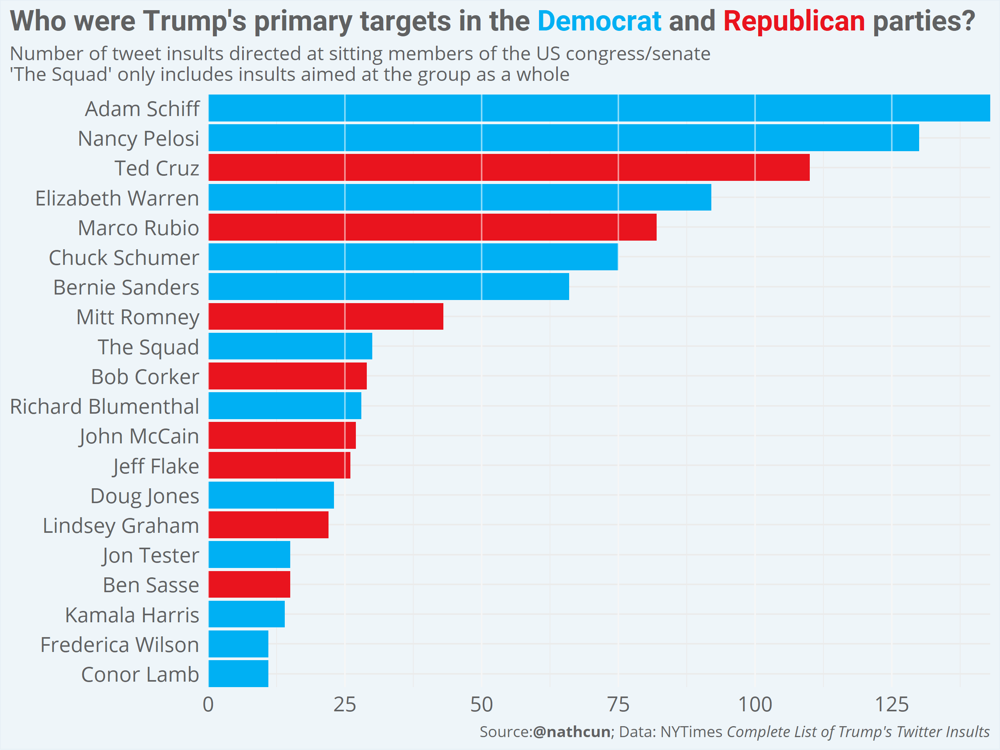
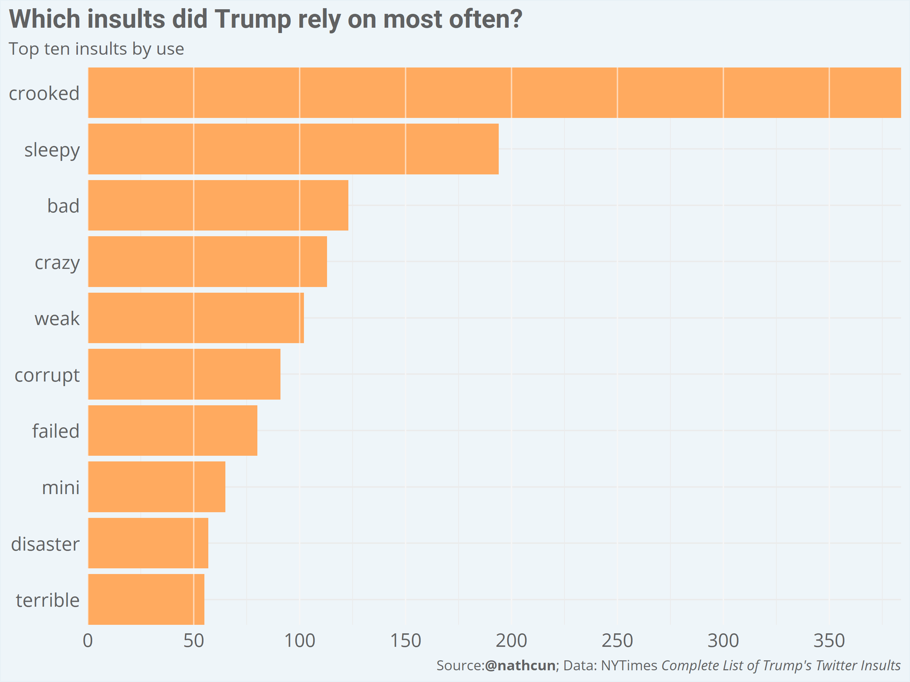
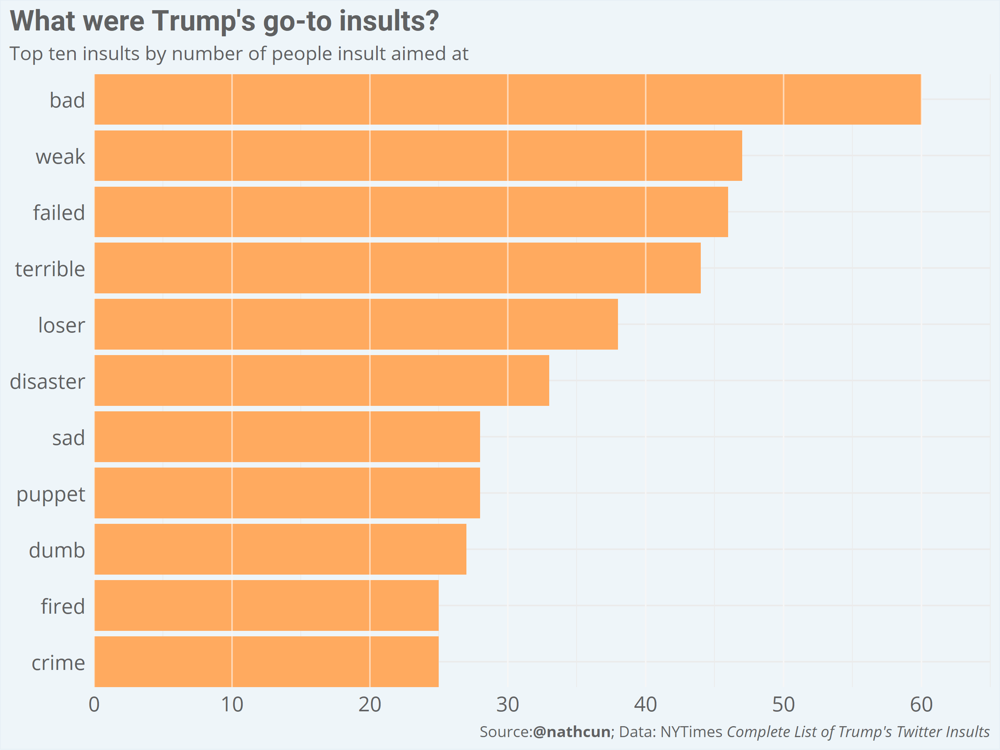
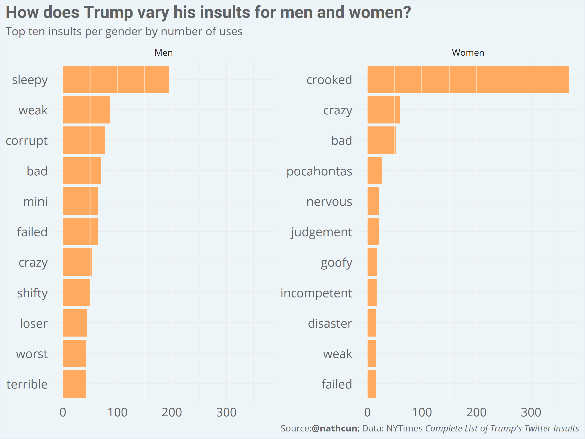
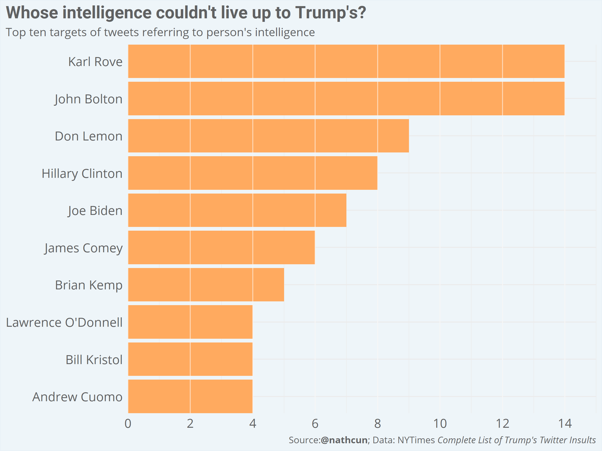

With the grim and bizarre reality of a Donald Trump presidency finally beginning to recede behind us, it’s a good opportunity to recap his time as president. For previous US presidents, we might expect to now be inundated with articles detailing major accomplishments, critical analyses of policy implementations, and so on. For Donald Trump, we got a catalogue of his [Twitter insults](https://www.nytimes.com/interactive/2021/01/19/upshot/trump-complete-insult-list.html).

*Photo by [John Cameron](https://unsplash.com/@john_cameron?utm_source=medium&utm_medium=referral) on [Unsplash](https://unsplash.com/?utm_source=medium&utm_medium=referral)*

The catalogue contains almost 4,000 separate insults levelled at over 400 different targets. It’s so vast as to be completely incomprehensible. That one’s Twitter account ever contained such vitriol, you would expect, would disqualify them from positions of leadership. However, like most scandals blighting Trump’s presidency, the woods stopped us focusing on any of the individual trees.

As a data scientist, I wanted to break down the catalogue to get a clearer picture of Trump’s tweets and answer some questions.

## Who did Trump insult most frequently?

There’s no prize for guessing who topped Trump’s target list. Hillary Clinton and Joe Biden had more tweets levelled at them, by far, than anyone else. The remainder of the top ten comprises Trump’s political foes at various points of his candidacy and subsequent presidency. Some on the list — Nancy Pelosi, Chuck Schumer, and Elizabeth Warren — were constants thorns in Trump’s side, while others — Jeb Bush, Adam Schiff, James Comey, and Michael Bloomberg — were products of particular points in time.

Ted Cruz makes the list — being on the wrong end of over 100 insults — despite receiving no tweet insults since the early days of the Trump presidency in May 2016. While Cruz is surely the most embarrassing example of it, he’s far from the only sitting Republican member of the US government to abide Trump’s attacks. When it came to hurling insults at elected representatives, Donald Trump wasn’t afraid to reach across the aisle.

## Which insults did Trump rely on most often?
Trump has never been accused of having an expansive vocabulary, except of course by himself. Which of the ‘best words’ in his repertoire did he rely on most often?

<iframe width="560" height="315" src="https://www.youtube.com/embed/lM2GFtO5VP0" frameborder="0" allow="accelerometer; autoplay; clipboard-write; encrypted-media; gyroscope; picture-in-picture" allowfullscreen></iframe>

There are no prizes for guessing which insults featured most prominently. Trump’s abiding obsession with Hillary Clinton pushes ‘crooked’ into a distant lead, with ‘sleepy’ Joe Biden making up second place. Although, of course, Clinton and Biden were the primary targets here, in both cases there were others on the receiving end: ‘sleepy eyes’ Chuck Todd, and ‘crooked cop’ James Comey, for example. It says a lot for the power of branding when so many of the insults immediately associate with a particular person: ‘crazy’ Nancy Pelosi, ‘crazy’ Bernie Sanders, ‘mini’ Mike Bloomberg.

Another way of looking at Trump’s vocabulary would be to ask which insults did he most often fell back on. When someone new crossed his path and he had to dig deep into his arsenal of ‘best words’, which words were his go-to?

These insults are a little more difficult to tie back to any individual. Note here that the words are just the most prominently used in insult tweets, after removing some typical filler words; the insults may not have been directly targeted at a particular individual, but instead formed part of the insult. For example, the prominence of the word ‘fake’ is due to the phrase ‘fake news’, rather than a suggestion that the target themselves were fake.

## How did Trump vary his insults for men/women?

Accusations of sexism were never far from Trump throughout his presidency. Although his Twitter insults were more often aimed at men — at a rate of over 2:1 — his go-to insult stayed the same: ‘bad’. In fact, it’s difficult to spot any stand-out differences in Trump’s typical treatment of the genders.

## Whose intelligence couldn’t live up to Trump’s?
Like any very stable genius, Donald Trump had a constant need to assure us of his intelligence, both by [claiming others are awed by his smarts](https://www.bbc.com/news/av/world-us-canada-51761880) and by highlighting just how much less intelligent those in his orbit are. To find out whose intelligence most grievously offended Trump, I searched for tweet insults containing any variation of words like ‘moron’, ‘fool’, ‘dope’, ‘ignorant’, ‘dummy’, ‘idiot’, ‘stupid’. Almost as if to demonstrate his own superiority, Trump seemed to select from a broader pool of his words to call someone an idiot than he would to call someone ‘bad’.

Although still primarily dominated by political adversaries, Trump’s base of supposed idiots extends to include journalists Don Lemon, of ‘Fake News CNN’ and Lawrence O’Donnell of ‘MSDNC’.

I anticipate this being a regular piece, so please join me in four years time for the recap of Biden’s biggest Twitter spats.