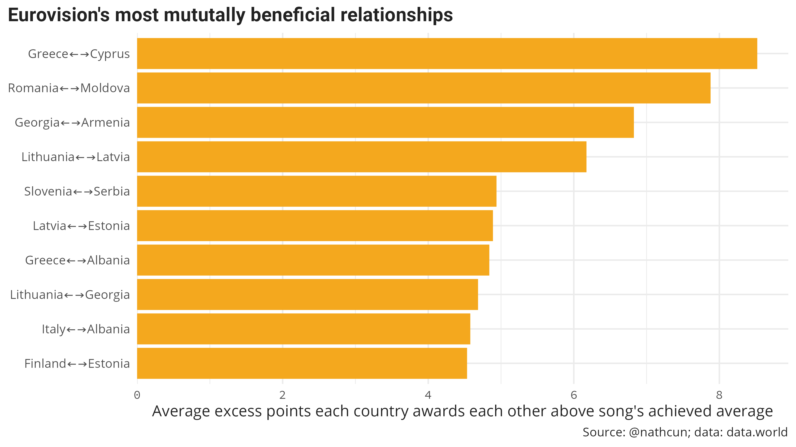

It's not exactly news that the Eurovision voting is not wholly dictated by which nation
gives the best songs. But


I pulled data from [data.world](https://data.world/datagraver/eurovision-song-contest-scores-1975-2019)


```r

```





