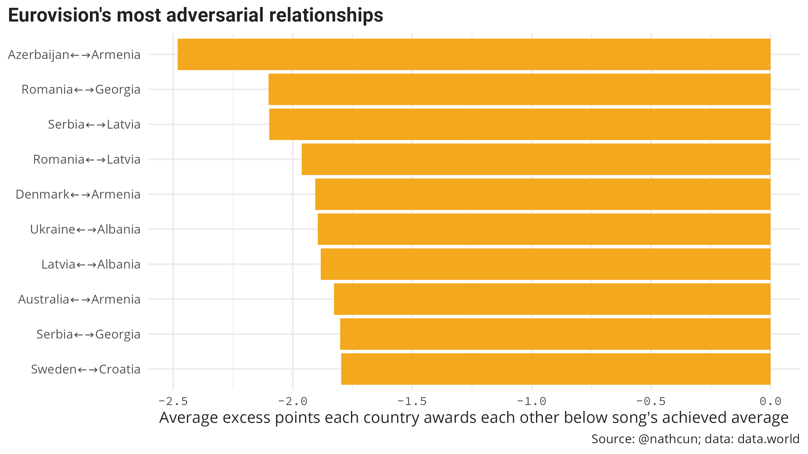
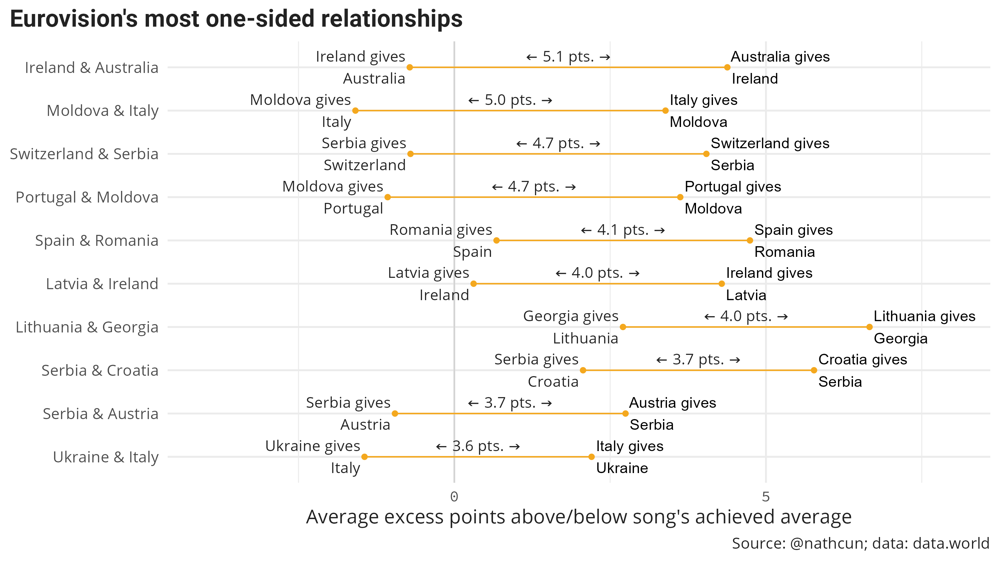

It's not exactly news that the Eurovision voting is based on more than just who sent 
the best song. Neighbouring countries are often more inclined to vote for one another,
or not in the case of Ireland and the United Kingdom. But which countries are most blind 
to the quality of the songs their favoured nations send?

To explore, I pulled data from [data.world](https://data.world/datagraver/eurovision-song-contest-scores-1975-2019) 
which lists the results of every final since 1957, including importantly how many points 
each country awarded to each participant.

Of course over this time there have been some national reshuffles and many of the 
countries of today, don't map neatly to a single historical participant. The only case, 
I believe, where there is a direct mapping is F.Y.R. Macedonia renaming to Republic of 
North Macedonia in 2019, but please let me know if I'm missing something. 
Let's first fix the data so that North Macedonia is named consistently, and no longer existing 
countries can be filtered out. I've also filtered the data to only consider the finals votes.

```r
library(tidyverse)
remove_countries <- c(
    "Rest of the world", 
    "Rest of the World", 
    "Serbia & Montenegro", 
    "Yugoslavia",
    )
results_df %>%
  mutate(
    to_country = case_when(
      to_country == 'F.Y.R. Macedonia' ~ 'North Macedonia',
      TRUE ~ to_country
    ),
    from_country = case_when(
      from_country == 'F.Y.R. Macedonia' ~ 'North Macedonia',
      TRUE ~ from_country
    )
  ) %>%
  filter(
        !to_country %in% remove_countries,
        !from_country %in% remove_countries,
        from_country != to_country,
        `(semi-)_final` == 'f',
    ) 
```

At this point, we can begin to look at which countries have the most mutually beneficial/adversarial
relationships. In order to identify a _special relationship_ between countries I considering only 
the boost in points that countries can expect above and beyond what their song was otherwise worth.
Otherwise, we may see that, e.g., Sweden/Ireland have a special relationship with many countries when in reality 
they've just won more times than others.

To do this I calculated the average points received by each country in each participating year, then for each
(giver, receiver) pair calculated what the average difference was, as below:

```r
differential_df <- results_df %>%
    group_by(to_country, year) %>%
    mutate(year_received_mean = mean(points),
            differential = points - year_received_mean) %>%
    group_by(from_country, to_country) %>%
    summarise(
        mean_differential = mean(differential)
    )
```

Looking at the top ten pairs, Greece and Cyprus are well in the lead awarding each other, on average,
an incredible eight points above what their song was deemed worth by the remaining nations. Elsewhere, 
the buddies are relatively unsurprising with neighbouring countries often being more generous with their votes.


As for the most adversarial nation pairs, the effect is much smaller with Azerbaijan and Armenia only short changing 
each other by just shy of 2.5 points of their song's worths. 
While there are similar geographic relationships here too, there are some others I can't say I understand. Sweden and Croatia? 





In many cases, the positive relationships between neighbouring countries is due to migration between the two nations, with emigrants then voting for their home nation in their adopted home. However, this flux doesn't always go both ways, and this can 
be seen to an extent in the most one-sided relationships. 



Ireland has for many years had a large number of emigrants to Australia, but relatively few in the other direction, which would explain why the Australians are so generous towards us while we largely give them what their song is worth. It should be noted, however, that during Australia's Eurovision participation Ireland have only yet managed to qualify for the final one time. 


